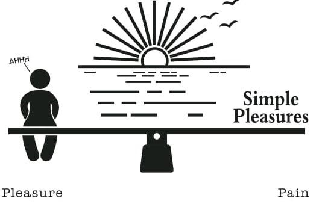



근 몇 달 동안 내 머리 속의 한켠에서 머무르고 있는 생각 중 하나는 "지속 가능한 보상체계를 위해 내 삶에 특정 수준 이상의 고통은 불가피하다는 것"이다. 물론 개인적으로 삶의 대부분의 측면에서 안전 마진을 중요하게 생각하고, 불꽃같은 삶 보다는 안락한 삶을 추구하는 편이기에, 이러한 생각은 마조히스트(Masochist)적 이라기보다는 추구하는 것을 꾸준히 추구하기 위한 엔진 교체 작업에 가깝다고 말할 수 있을 것이다.

생각의 흐름을 조금 더 따라가 본다면, "원하는 것을 너무 쉽게 얻는 것이 지속가능하지 않다"는 생각이 저변에 깔려있는 듯 하고, 이는 인간의 보상체계를 서서히 균열내는 것이기에 그렇다.

이어지는 몇 가지 컨텍스트를 가져와 보면 이렇다.

1. Youtube Shorts / Instagram Reels로 대표되는 숏폼 컨텐츠들이 무너뜨리는 보상체계 

쇼츠에서 예쁜 연예인들의 영상을 손가락 하나로 내가 원하는 만큼 원하는 부분만 마음껏 볼 수 있다. 생각해보면, 주변에서 보기 어려운 사람들의 다양한 모습을 볼 수 있는 "보상"을 얻기 위해 내가 들이는 "노력"이 말도 안될 만큼 쉽다. 이전에는 아리따운 여인을 얻기 위해서는 목숨을 건 전쟁을 해야 했다.

2. 강도 높은 운동이 보상체계에 미치는 영향

최근 크로스핏을 등록해서 다니고 있다. 크로스핏은 운동의 강도가 지금까지 혼자 해왔던 운동에 비하면 비교가 되지 않을 정도로 높아서 운동이 끝나고 나면 바닥에 드러누워 적어도 5분간은 헐떡거리며 쉬어야 한다. 집에 돌아와 누우면 그저 아프지 않고 누워 쉴 수 있다는 사실에 굉장한 만족감을 얻는데, 찬물샤워와 마찬가지로 몸에 적당한 고통을 가한 후 이 고통을 이완하는 것만으로 인간의 뇌는 보상을 받는다고 느끼며, 이는 보상체계가 지속가능한 긍정적 피드백 루프를 형성하는데 도움을 준다.

이런 몇 가지 줄기의 생각들로부터 내 삶을 움직이는 보상체계에 대한 고민들을 다시 해본다. 삶을 지탱하는 몇 가지 중요한 보상이 있는데, 그것들이 과연 적당한 고통을 가해 시소의 한쪽을 누르고 그것이 균형을 맞추기 위해 다시 튀어 오르면서 생기는 보상인가? 아니면 보상을 얻는 것이 현재의 능력을 고려했을 때 비교적 적은 고통을 가해도 얻을 수 있는 것인가? 

만약 후자라면, "워라밸"이라는 이름 하에 적은 노력으로 비교적 큰 보상을 맛볼 수는 있겠지만. 시간이 지남에 따라 체감되는 보상의 크기는 작아질 것이며 긍정적인 보상체계의 강화가 만들어내는 복리 효과를 얻지 못하게 되기 때문에 향후 몇년간 이루어질 보상의 크기에 메울 수 없는 공간을 만들지 않을까.

고통과 보상의 매커니즘을 잘 조절해서 내가 느끼는 고통의 크기가 고통의 대가로 얻는 보상보다 조금은 크다고 느낄 때, 보상체계가 끊임없이 개선되는 flywheel을 돌릴 수 있지 않을까 생각해본다. 현대 사회가 야금야금 무너뜨린 인간 뇌의 보상체계 매커니즘은 현 세대로 하여금 새로운 시도를 하지 않게 만든다. 아니, 할 수 없게 만든다고 보는게 더 적절할지도 모른다. 클릭 한번, 스와이프 한 번이면 너무나도 쉽게 보상을 얻을 수 있는데, 굳이 다른 보상을 얻기 위해 고통을 가해야 하는가. 삶에는 고통이 필요하다. 고통 없는 행복은 지속가능하지 않은 것 같다.

> 고통 쪽으로 기울어진 쾌락-고통 저울은 앞서 상당한 절제 기간을 거친 사람들도 다시 중독에 빠지게 만든다. 왜 그럴까? 우리의 저울이 고통 쪽으로 기울어 있으면, 그저 평범한 기분(수평 상태)을 느끼려 해도 중독 대상의 도움이 필요하기 때문이다. - Dopamine Nation
