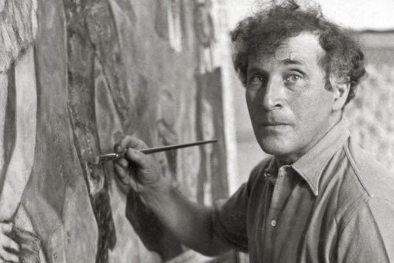

위대한 예술가나 발명가, 기업가들 중에는 다작(多作)을 하는 사람들이 많은 듯 하다. 이들이 가진 위대함은 어떤 방향으로든 세상에 영향을 미치게 되므로 이들이 가진 위대함에 다가가기 위해 나도 다작가가 되어야겠다는 생각과 함께 떠오르는 몇 갈래의 생각들을 정리해본다.

다작이 위대함에 이르는 통로인 것은 분명하다. 그러나 많은 잘못된 명제적 접근이 그렇듯, 다작을 하는 모든 이들이 위대해지는 것은 아니다. 그렇다면 한 사람의 위대함에 도달하는 길에 다작은 실제로 영향을 어느 정도로 미치는가, 만약 그러하다면 어떤 이유에서인가.

일단 무언가를 만들기 시작하면, 만들기 전과는 근본적으로 다른 계(System)에 진입한다. 만들기 전에 생각하고 가정했던 것들이 뉴런의 세계에서 물리 세계로(그것이 소프트웨어라 할지라도) 나타나기 시작하면 우려했던 것들이 생각보다 큰 문제가 아닌 경우도 생기고, 반대로 전혀 예상하지 못했던 문제들이 나타나기도 한다. 이 차이에서 오는 "감"을 직접 부딪혀서 익혀야 한다. 즉, 다작의 위대함은 생각의 발현을 빠르게 함으로써 기민한 감각적 지식을 획득하게 한다는 데 있다.

손자는 실제 전장에 나가 전투를 수행하는 "장군"의 중요성에 대해 역설한다. 직접 전장에 나가 전투를 수백번 치뤄낸 장군만이 갖고 있는 "물리적 지식"이 있다. 창을 쥔 손끝의 감각, 미세한 공기와 습도의 차이, 지형에서의 우세와 같은 지식들은 직접 겪어내지 않고서는 얻을 수 없는 것이며, 책상 앞에 책을 펴고 앉아 이들의 글을 읽는 것만으로는 이 지식을 충분히 활용할 수도 없다.

> 모든 기술 관리자는 실무 경험을 갖춰야 한다. 예컨대 소프트웨어 팀 관리자는 업무 시간의 20퍼센트 이상을 코딩에 할애해야 하고, 태양광 지붕 관리자는 일정 시간 이상 지붕에 올라가 설치 작업을 해봐야 한다. 그렇지 않으면 말을 타지 못하는 기병대장이나 칼을 쓸 줄 모르는 장군과 같아진다. - 일론 머스크

저마다의 시스템 속에서 그럴듯한 이야기와 논리를 갖고 작품을 만들어내는 건 쉽다. 그러나 정말 위대한 작품은 세밀한 "감각"으로부터 탄생하며, 이 기민한 감각은 실제로 전장에 뛰어들어 전쟁을 치뤄내지 않고는 얻어낼 수 없다. 다작은 감각적 지식을 갖고 이론을 사용하는 것과 이론을 통해 경험한 적 없는 감각적 지식을 추론하는 것 사이의 넘을 수 없는 간극을 만든다.
