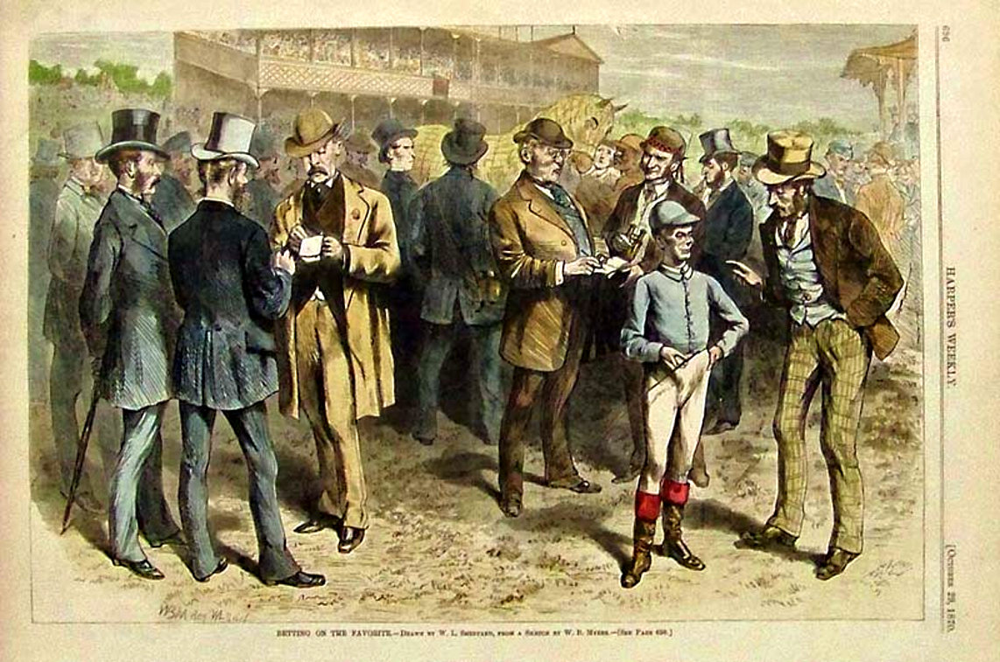
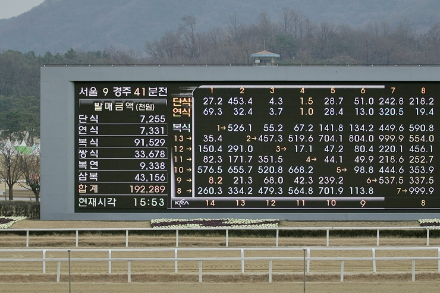

> 애널리스트는 현금흐름을 예측하려고 방대한 과거 데이터를 살펴보지만 시간 낭비에 불과합니다. 진정한 투자는 패리 뮤추얼 베팅에서, 예컨대 확률은 50%인데 배당은 3배인 곳에 돈을 거는 것과 같습니다. 가치투자는 '가격이 잘못 매겨진 도박 대상'(mispriced gamble)을 찾아내는 행위입니다.

'찰리 멍거 바이블'을 읽고 패리 뮤추얼(Pari Mutuel) 시스템을 경험적으로 이해하고 싶은 마음에 경마장에 다녀왔다. 패리 뮤추얼 시스템이란, 시스템에 대해 돈을 거는 것이 아니라 고객 상호간에 돈을 걸고, 시스템에게 일정의 수수료를 지불한 뒤 고객 상호간에 건 판돈을 두고 베팅에 성공한 자들이 상금을 나눠 갖는 방식을 의미한다. 

패리 뮤추얼 시스템의 재밌는 점은 베팅이 종료되기 전까지, 경마장의 경우 경주가 시작하기 직전까지 배당률이 결정되지 않는다는 점이다. 시스템(여기서는 경마장)은 전체 판돈에 대해 수수료를 취하므로 결과에 상관없이 돈을 버는 구조이며, 베팅에 참여하는 자들이 많을수록 더 많은 이익을 얻는다. 한편, 베팅하는 자들은 이러한 시스템 하에서 손실을 볼 가능성이 더 높다. 이길 것이 거의 확실한 말에 돈을 걸어도 이러한 말을 알아보는 사람들이 많을 수록 내가 얻을 수 있는 배당은 기하급수적으로 떨어진다. 게다가 모든 사람이 동일한 말에 베팅할 경우 모든 참여자가 약간의 손실을 보게 된다. (배당률이 0.99에 가깝게 떨어지므로)

결과적으로 두 번 베팅했으나, 두 번 모두 아쉬운 차이로 결과를 맞히지 못해서 100% 손실이 났다. 흥미로웠던 점은 안전하게 배당률이 가장 낮은 말을 골라서 2~3배 수익만 소소하게 먹자고 베팅한 두 번의 베팅이 모두 실패했다는 점이다. 베팅 마감 시간이 다가오고, 판돈의 금액이 베팅 마감 시간에 비례해 기하급수적으로 늘어날 수록, 배당률의 변화가 급격히 변화하지만 초반에 형성된 몇가지 기준에 의한 Seed에 의해 이후 배당률의 변화가 영향을 받을 수 밖에 없는 구조로 보였다. 

결국 두 번의 베팅 모두 배당률이 가장 낮게 시작했던 말들은 베팅이 끝날때까지도 가장 낮은 배당률로 가장 많은 선택을 받았고, 당연히 실제 경주 환경에서는 말들이 넘어지거나, 그날의 컨디션이 안좋다거나 하는 여러 예측하기 어려운 변수들로 인해 모두 예측과 다른 결과가 나왔다.

멍거는 저서에서 주식시장이 패리 뮤추얼 방식만큼 효율적이라고 말했고, 개인적으로 이 말에 매우 동의한다. 좋은 말을 선택한다고 해서 무조건 베팅에 성공하는 것이 아니듯이, 좋은 기업을 매수한다고 해서 무조건 시장 수익률을 초과하는 것은 아니다. 

또한 패리 뮤추얼 시스템 하에서 자주 베팅하면 자주 잃게 된다. 진지한 태도로 수익을 얻기 위해 패리 뮤추얼 시스템에 참여하려 한다면 지속적으로 승리할 수 있는 방법에 대해 고민해야 할 텐데, 멍거의 말마따나 배당률이 잘못 매겨진 말을 찾아 한두번의 베팅을 크게 거는 것이 계란을 여러 바구니에 나눠 담겠다고 작게 여러번 베팅하는 것보다 낫다.

한편, 경험을 통해 어설프게 이해한 패리 뮤추얼 시스템을 하나의 도구로 이해하고 이것을 다학제적 틀 안에 넣어 필요할 때 적절하게 다른 도구들과 비교하여 활용해야 할 것 같다는 생각이 든다. 인생에서 무언가를 결정한다는 것은 그 결정에 대해 시간을 비롯한 여러 리소스를 투자한다는 행위이다. 이때 그 결정이 속한 계(System)가 패리 뮤추얼이 적용되는 시스템이라면 멍거의 지혜를 활용한 결정을 하는 것이 현명하다 할 수 있겠다.