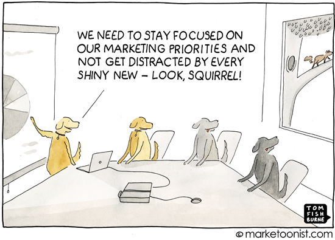

>반짝이는 물체 증후군의 부정적인 영향은 다음과 같다.
>첫째, 프로젝트를 완료할 수 없다. 진행 중인 프로젝트에서 의미 있는 결과를 보기도 전에 다른 프로젝트에 흥미가 생기면 거기에 뛰어들기 때문이다.
>둘째, 아이디어와 지침에 대한 계획이 빈약하다. 반짝이는 물체 증후군이 있는 사람은 전략이나 변화 그 자체보다는, 주어진 전략을 추구할 때 느껴지는 짜릿함이나 특정한 변화를 만들어내는 것에 더욱 집중하는 경향이 있다.

동시에 여러 일을 하면서 지금 하는 일에 집중력을 잃지 않기란 대단히 어렵다. 나의 경우 대개 그 이유는 하나의 일에 집중하다가 번쩍 떠오른 훌륭해 보이는 아이디어들을 놓치지 않으려는 마음 때문인데, 긴 휴가를 보내며 나의 이러한 사고/행동 방식에 대해 고찰해보며 몇 가지 개인적인 점검을 해본다.

우선 가장 문제되는 건, 전환 비용이 크다는 것이다. 책을 쓰다가 운영하고 있는 서비스에 대한 아이디어가 떠올라서 이를 메모해야겠다는 생각으로 이어졌을 때, 이 생각을 기록하기까지 걸리는 시간과 경로들이 과도하다. 굳이굳이 이 생각을 논리적으로 배열해서 알맞아 보이는 곳에 넣으려는 집착 때문인데, 이 때문에 단순히 아이디어만 적고 돌아오면 될 걸, 불필요한 문서들과 컨텍스트들을 다시 꺼내 뒤진다. 이렇게 두어번 토끼 굴에 다녀오고 나면 책을 쓰는 일 자체에 집중할 수 없는 상태가 되어버린다. 따라서 이러한 사고 방식에 대해서는 다음과 같은 개선 방안을 시도해보려 한다.

1. 번뜩이는 아이디어(인 것 같아보이는)가 떠오르면 우선 바로 컨텍스트 전환을 하기 전에 심호흡을 한다. 필연적으로 전환에는 비용이 따를 것이고, 이 비용은 지금 내가 하는 일에 필요한 에너지이므로 그만한 가치가 있는가를 한번 더 호흡하며 고민한다
2. 부득이하게 기록해야 할 경우에는 텅빈 노트에 아무렇게나 적고 나중에 본다. 

다음으로 돌아보아야 하는 사고 패턴은 완결성 없이 사고의 자극만을 좇는 경향이 있다는 것이다. 돌아보면 개인적으로 가장 큰 결함이라고 생각되는 부분이다. 대부분의 일들이 그러하듯, 재미로 시작한 일들도 결과를 보기 위해서는 지루하고 고통스러운 Long Tail 구간을 넘겨야 한다. 어찌어찌 50%의 완성도까지는 재미와 흥미로 만들어낼 수 있겠지만 고객에게 가치를 전달하고 유의미한 결과를 만들어내기 위해서는 나머지 50%를 채워야 하며 이 과정은 대개 지루하고 힘든 여정이다. 이 과정을 견디지 못하고 흥미가 생기는 다른 자극을 좇아 다른 50%를 만들어 간다면 2개의 프로젝트를 열정적으로 운영하는 것 같지만 실제로 창출하는 가치는 0이다.

사고의 자극을 좇아 유영하는 것 자체는 많은 도움을 준다. 그러나 이것으로 가치를 만들어내야겠다고 생각했다면 조금 더 끈기를 가지고 결과를 볼 때까지 지루한 Long Tail 구간을 버티는 연습이 필요하겠다.

>당신은 항상 차선책을 추구하고 있다. 필요하거나 원하는 것이 무엇인지 명확하지 않은 상태로 이런저런 아이디어들을 넘나든다. 하던 일을 계속해서 바꾸면 빨리 지치게 된다
