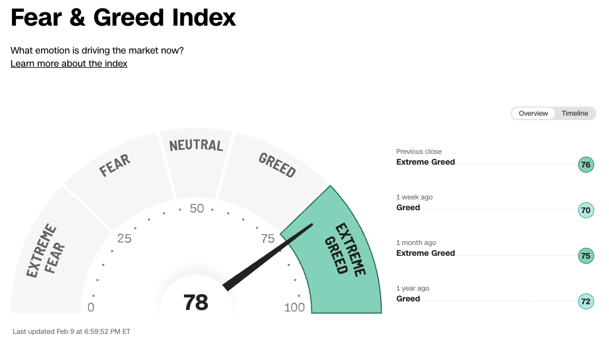

팔란티어가 2023년 4분기 어닝 콜을 했다. 5분기 연속 흑자를 비롯해 여러 지표로부터 어닝 서프라이즈가 나왔고, 한주동안 50% 가까이 급등했다. 기존 주가도 충분히 높다고 생각했다. 가격이 잘못 매겨졌다는 생각이 들었고, 10달러 초-중반에 보유하고 있던 수량의 많은 부분을 20달러 초반에 매도했고, 자산의 상당부분을 팔란티어가 차지하고 있었기에 상당한 수익을 얻었다. 매도 후에 25달러까지 올라간 것이 아쉽긴 하지만, 버핏의 말마따나 시계가 없는 무도회장에서 호박으로 변하기 직전인 11:59분에 정확히 나올 수는 없는 노릇이다.

저마다의 기준이 있겠지만, 내게 이번 거래는 꽤 유의미했다. 잘못 매겨진 낮은 가격에 구입해서 잘못 매겨진 높은 가격에 매도했고, 인생을 바꿀 정도는 아니지만 어쨌거나 유의미한 수익을 얻었다. 그러나 진정한 의미는 안티프래질, 블랙 스완, 패리 뮤추얼, 손자병법등 개인적으로 갈고 닦던 여러 인문학적 통찰들을 운좋게 찾아온 기회를 발판 삼아 실물 세계의 이익으로 전환했다는 것이었다. 부를 비롯해서 극단의 왕국에 존재하는 여러 속성들은 꾸준한 상승 곡선에 존재하기보다는 한두번의 성공으로 대부분의 이익이 결정되는 예측하기 어려운 그래프 상에 존재한다. 앞으로 몇 번의 도약이 더 남았다 생각하기에, 이 기회를 잡기 위한 몸풀기의 첫 단계 정도는 진입한 느낌이다.

기업의 가치는 많은 것들에 의해 결정되지만, 이번 매도 결정은 기업의 내재 가치가 훼손되었다기보다는, 내재 가치에 비해 현재 거래되고 있는 가치가 과장되었다고 느끼기 때문이다. 즉, 높은 쪽으로 가격표가 잘못 매겨졌기 때문이다. 매일매일 변동되는 주가와 FOMO 심리에 눈이 돌아갈 수도 있지만, 이럴 때일수록 호흡을 가다듬고 우선순위를 가다듬어야 한다.

몇 가지 기본적인 숫자 계산을 해보았다.
2024년 2월 11일 기준으로 팔란티어의 (급등한)현재 주가는 $24.38이다. 총 발행 주식 수는 2,175,989,369개로 22억개 정도 되니 팔란티어의 현재 총 기업 가치는 $53B(1300원 환율 기준, 대략 70조 정도)가 된다.

다음으로는 매출과 순이익을 보고, 이와 관련된 여러 재무적 지표를 확인해야 한다. 이번 4분기 어닝에서 발표한 GAAP Net Income이 $210M 이므로 PER(Per Earning Ratio)는 250배 정도가 되며, 주당 순이익은 $0.09 정도가 된다. 팔란티어가 흑자로 전환한지 얼마 되지 않았기 때문에, PER과 EPS의 절대적인 수치를 따지는 것이 유의미하지는 않지만, 테슬라가 62, 엔비디아가 120 정도임을 감안할 때, 상당히 높은 수치로 평가받고 있음을 확인할 수 있다. 본래적인 주식의 의미만을 본다면, 지금 시점에서 팔란티어 주식을 매수했을 때, 할인율을 제외하고 투자 원금을 회수하기 위해서는 250년이 걸린다.

이 PER이 현재의 강한 매수세와 더불어 불어온 AI 붐에 의해 과장되었다는 생각이 들었다. 대부분의 투자자들은 AI가 뭔지, AI가 어떤 실질 효용을 제공하는지에 대해 관심이 없을 뿐더러 잘 알지 못한다. 나도 AI에 대해 잘 안다고는 말할 수 없을지 모르지만, 90% 이상의 투자자들이 나보다 AI에 대해 모른다는 건 자신 있게 말할 수 있다. 따라서 이들에 의해 올려진 기업의 가치는 위험하다고 판단했다. 

한편, PER이나 현재의 주가 수준을 떠나 회사 자체의 성장과 내재 가치의 측면에서 보면 흐름은 너무나도 좋다. 매출, 영업 이익, 순이익을 비롯한 모든 수치들이 지속적으로 상승하고 있으며, 최근 4분기 연속 흑자를 달성해서 S&P 500 편입을 위한 마지막 퍼즐도 맞추었다. 특히 최근에 여러 매크로 변화가 생기면서 기업의 부채와 상환 능력, CEO의 네트워크와 신용도를 지속 가능한 가치를 창출하기 위한 기업의 기준 중의 하나로 생각하고 있는데, 기업의 유동 현금 흐름이 지속적으로 증가하고 있는 건 매우 긍정적인 신호 중 하나라 해석했다.

이제 기업의 지속성과 폭발적인 성장을 위해 한 가지 지속적으로 지켜보면서 확인해야 하는 지표는 AIP의 등장으로 인한 영업 비용(Operating Expenses)의 감소가 유의미하게 일어나는가이다. 개인적으로는 사실상 이 지표가 향후 몇 분기간 팔란티어에서 지켜보아야 하는 지표의 거의 전부다. 고담, 파운드리, 아폴로와 같은 팔란티어의 B2B SaaS 특성상 영업비용이 지출의 대부분을 차지하는데, FDE가 직접 클라이언트에 가서 제품을 교육하고 온보딩하는 비용을 개선하는 만큼 EPS가 증가할 뿐더러 유입되는 고객의 폭발적 성장을 기대할 수 있기 때문이다.

개인적으로 팔란티어는 매우 좋아하는 회사다. 언젠가 일해보고 싶은 회사이기도 하고, 앞으로 나올 거의 모든 회사들의 어머니가 될 수 있는 회사라고 생각한다. 이제는 망하기 어려운 구조를 갖추었고, S&P 500 지수에 편입될 조건도 갖추었다. 그럼에도 불구하고 시장과 매크로의 변화에 따라 여전히 등락이 있을 것이라 생각한다. 특히 올해는 더 그렇다. 

기업의 측면에서 보면, CEO인 알렉스 카프는 헤겔주의와 사회주의 성향이 뚜렷한 사람이고(IR에 We Stands for Israel 이라고 대문짝만하게 써놓는거부터가 평범하진 않다.) 자신의 소신대로 회사를 이끌어나갈 경영권을 쥐고 있기 때문에 투자자들의 원하는 방향이 아닌 자신이 창업한 시점부터 그려왔던 그림을 아랑곳하지 않고 그려올 것이다. 4년동안 투자하면서 숱하게 욕을 먹는 걸 봤고, 그럼에도 불구하고 아랑곳하지 않고 자기가 마음먹은대로 선택하는 걸 봤다.

이런 상황에서 시장이 기대하는 방향과 팔란티어가 가고자 하는 방향이 달라 그 사이에 틈이 생길 때, 잘못 매겨진 가격표가 달릴 것이며, 꾹 참고 기다리면 한두 번은 더 올 것이라 생각한다.

한편, 매크로적인 측면에서 보면, 올해는 정말 변동사항이 많다. 기업의 외부 가치(주가)를 뒤흔들 수 있는 요인이 많다는 이야기다. 생각보다 오래갈 것 같은 고금리와 11월에 있을 대선, 그리고 2 격전지에서 벌어지고 있는 전쟁과 중국-대만 사이의 내전, 그리고 기후 변화 이슈와 두 운하로부터 시작한 공급 쇼크까지. 이 많은 이슈들이 "훌륭하다"고 평가받는 기업들을 뒤흔들 것이며, 이는 투자자의 입장에서 기다림직할 만한 기회다.

팔란티어를 굉장히 좋아하고, 그들이 바꾸고 싶은 세상을 지지하기에 나는 버핏의 말처럼, 팔란티어의 가격표가 아래로 잘못 매겨지기를 바라고 있다.

> 당신은 평생 햄버거를 먹을 계획인데 소를 키우지 않는다면 소고깃값이 올라가기를 바랍니까, 내려가기를 바랍니까? 마찬가지로 당신은 간혹 차를 사야 하는데 자동차 제조업자가 아니라면 자동차 가격이 올라가기를 바랍니까, 내려가기를 바랍니까? 물론 답은 질문 안에 있습니다. 
> 
> 이제 마지막 퀴즈입니다. 당신이 앞으로 5년 동안 주식을 사 모은다면 이 기간에 주식시장이 올라가기를 바랍니까, 내려가기를 바랍니까? 이 퀴즈에는 틀리는 투자자가 많습니다. 앞으로 장기간 주식을 사 모을 사람들조차 주가가 오르면 기뻐하고 주가가 내리면 우울해합니다. 이는 햄버거를 사 먹으려는 사람들이 소고깃값이 오른다고 좋아하는 셈입니다. 이런 반응은 이치에 맞지 않습니다. 
> 
> 곧 주식을 팔 사람들만 주가가 오를 때 기뻐해야 합니다. 주식을 살 사람들은 주가가 내려가기를 바라야 합니다.

