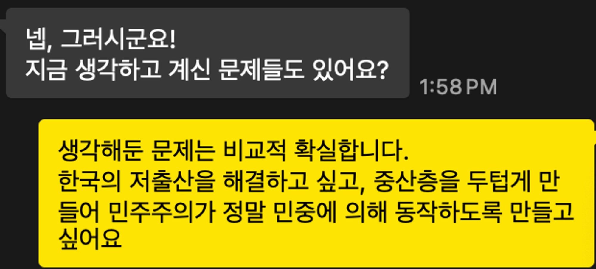

> 되게 자유롭고 유연한데 여전히 큰 움직임을 만들 수 있는, 그리고 되게 유능한 인재들이 모이는 곳. 지금 기업이죠. 일류들은 지금 기업으로 모이고 있으니까. 그래서 기업에서 이걸 뭔가 풀어가야 된다는 생각은 있어요.

정신없이 지나간 입시 기간을 거쳐 대학생이 된 이후로 나의 꿈은 하나였다. "좋은 아빠가 되는 것" 내가 생각하기에 좋은 아빠가 되는 것은 자녀를 잘 먹이고 좋은 것을 입혀서 좋은 대학에 보내어 피라미드의 최상단으로 보내는 것을 의미하지는 않았다. 시간에 따라 변해온 생각이 아니라 이전부터 변하지 않았던 핵심 전제다. 먼저 좋은 남편이 되는 것. 그리고 교육 방식이나 도덕, 가치관을 넘어 자녀 세대가 살아갈 세상을 지금보다는 더 희망이 있고 도전할 만한 곳으로 만드는 것. 그래서 내 자녀가 같은 세대와 함께 새로운 꿈을 꾸고 그 꿈을 이후 세대에 또다시 물려주는 것.

같은 관점에서 최근 주목하고 있는 몇 가지 문제가 있다. 여기서 주목하고 있다는 것은 굉장히 도전적이고 최선을 다해도 성공할 가능성이 지극히 낮지만, 인생을 걸어볼 만큼 충분히 가슴 뛰게 하는 무언가를 의미한다. 대한민국의 저출산을 해결하는 것, 그리고 민주주의가 더 나은 방식으로 작동하게 하는 것. 이 둘은 밀접하다고는 말할 수 없겠으나 양의 상관관계를 갖고 있는 듯 하다.

저출산 문제부터 논해보면, 0.7명이라는 출산율이 지속된다면 2070년 대한민국의 중위 연령은 65세가 된다고 한다. 인구 자체의 감소와 함께 필연적으로 발생하는 평균 연령의 상승은 여러 측면에서 국가 경쟁력이 약화되어 국가의 지속 가능성을 현저히 낮춘다. 생산 가능한 인구가 줄어들며, AI / Robotics 등의 기술을 사용하여 이를 개선한다 하더라도 과도한 연금 체계와 노인 복지로 인해 혁신과 발전에 사용될 예산이 현저히 감소한다. 이러한 상황에서 국가의 경제를 책임지는 기업이 무언가를 하기 위해서는 아웃 소싱을 하거나 외노자 비중을 확대해야 하며, 이는 문화적으로나 경제적으로나 우려스러운 부분이 많다. 

여러 이유들이 있겠지만, 부의 양극화와 상대적 박탈감의 문제, 그리고 이를 확산시키는 에코 챔버(Echo Chamber)가 원인의 주요 축을 차지하고 있지 않나 생각한다.

소셜미디어가 지대한 영향을 끼치고 있는 현 상황에서는 평균이 아닌 특수한 상황을 평균적인 것으로 눈속임하여 비즈니스를 하기 쉬워졌다. 이는 제품을 판매하는 비즈니스와 광고 비즈니스의 관점에서는 부가가치를 창출하는 행위이지만, 결과적으로는 평범에 도달하는 것이 인생의 목표인 세대를 만들어 냈다. 

자신이 평균보다 한참 하위에 있다고 생각하는데, 그 외의 다른 것들에 신경을 쓰기란 결코 쉬운 일이 아니다. 게다가 우후죽순으로 등장한 여러 관찰형 예능 프로그램과 함께 이 세대는 결혼과 양육, 생활과 소비에 대한 말도 안되는 평균에 도달하기 위해 애쓰는 세대가 되어 버렸다.

시대를 막론하고 부의 균등분배는 말도 안되는 이야기라는 점에는 매우 동의한다. 수렵 채집 시대를 제외하면, 어느 시대든지, 어떤 정치 체제에서든지 부는 편중된다. 중요한 것은 비율의 문제다. 지금은 'YOLO', 'FIRE' 같이 중산층을 붕괴시킬 수 있는 주요한 사상적 메세지들을 전달하고 에코 챔버를 통해 마치 거의 모두가 이런 생각을 갖고 있는 것처럼 만들기가 굉장히 쉬워졌다.

한편, 부의 양극화는 저출산에 직간접적으로 기여할 뿐더러 민주주의의 기반을 약화시킨다. 루소가 이야기했듯, 강력한 사회 제도가 완결되기 위해서는 누군가에게 예속될 만큼 가난하지 않고, 누군가에게 굴복해야 될 만큼 부유함에 대한 격차가 크지 않아야 한다. 부의 양극화는 극소수의 부유한 자들과 대다수의 가난한 자들을 만들고 가난한 자들을 생계에 눈멀게 만들어 민주주의에서 민중을 소외시킨다. 당장 오늘 먹을 밥이 없는데 어떻게 공공선에 대해 이야기 하며 더 나은 미래를 그릴 수 있겠는가

한두개의 해결책으로 이 문제를 해결할 수 있는 것은 아니며, 내가 생각한 원인이 실제 유효한 원인이 아닐 수도 있을거라 생각한다. 하지만 중요한 것은 문제 정의와 실행, 그리고 이를 반복할 줄 아는 끈기이며, 끈기는 내가 이 문제를 풀어야 할 이유에서 나온다. 이것이 정녕 문제 해결에 어떤 방향으로든 이어진다고 할 때, 이 문제는 꽤나 열정적으로 달려들 수 있을 것 같다.

가장 작은 것부터 시작하자. 우선은 사람들을 오프라인으로, 그러니까 에코 챔버 바깥으로 끌어내어 서로 마찰할 수 있도록 만드는 유연한 방법을 찾아보려 한다. '모두가 그런줄 알았는데 생각보다 나처럼 생각하는 사람이 적네', '이 사람은 이런 생각을 하고 있네'와 같은 감당할 수 있는 수준의 고통을 통해 전체 세대의 강건함의 크기를 키우고 싶다. 개인적으로도 좋아하는 일이기도 하고, 실패하더라도 파멸적인 결과를 불러올거라는 우려도 없다.

지속 가능해야 하는건 에너지와 지구뿐만이 아니다. 인류와 문명 또한 지속 가능해야 하며, 이러한 것들에 대해 고민하는건 리프레시 휴가 기간을 즐기는 꽤나 재밌는 방법중 하나이다.

