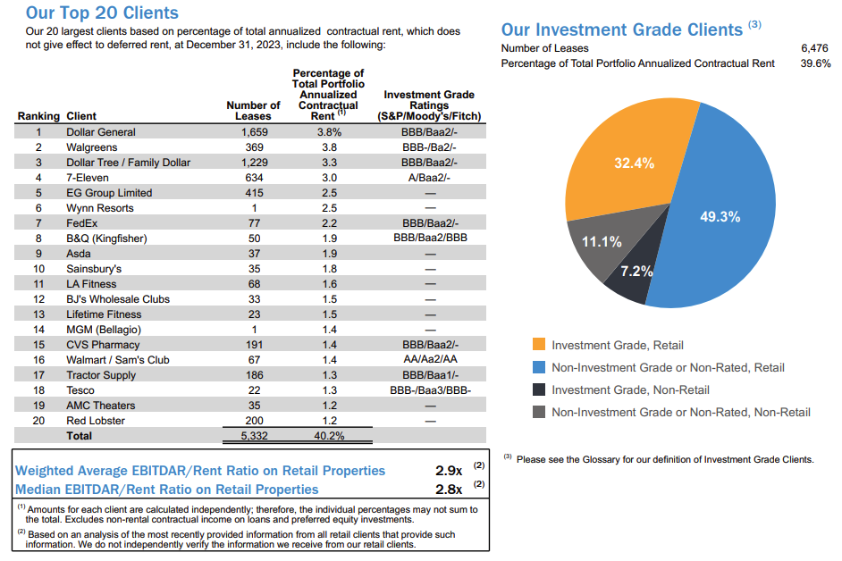

최근 미국 상업용 부동산 문제가 불거지면서 전반적으로 리츠(REITs)들의 가격들이 많이 떨어지고 있다는 사실을 발견했다. "상업용 부동산 문제로 인해 덩달아 빠진 리츠는 무엇이 있는가"가 주된 관심사가 되었고, 결과적으로 보유하고 있던 리얼티 인컴(O)의 비중을 늘리는 결정을 했다. 여기에는 몇 가지 근거가 있으며, 사후적으로 이 판단의 결과를 돌아보기 위해 남겨본다.

먼저, 비중을 늘리는 결정을 할 때에 가장 크게 고려하는 것은 안정성이다. 특히 리츠와 같이 배당이 핵심인 부동산 기반 자산에 투자를 할 때에는 더 그렇다. 이에 대해 고려하는 몇 가지 사항이 있다.

### 월 배당금을 꾸준히 지급했는가?

3/14일, 리얼티 인컴의 CEO는 리얼티 인컴이 역사적으로 104분기 연속 월배당금을 늘렸다는 사실을 발표했다. 한국 시간으로 3/19일 입금된 월 배당금은 주당 $0.2565로, 현재 주가 $52 수준에 대해 대입하면 월 0.5% 정도, 연으로 환산하면 연이율 6% 정도의 배당률이다. 

산술적으로 대략 7천만원 정도를 투자해서 1000주 정도를 보유하고 있다면 월에 35만원, 연에 420 정도의 세전 배당 수익을 얻게 된다. 일반적으로 리츠주는 가지고 있는 부동산의 감가상각 비용을 배당을 계산할 때 넣지 않기 때문에 배당을 계산하는데 있어 투자자에게 유리하게 작용하는 면이 있다. 

### 신용등급 / 매출은 어떠한가?

신용등급 관련해서는 리얼티 인컴 자체의 신용등급과, 입주한 클라이언트들의 신용등급을 모두 보아야 한다. 리얼티 인컴의 신용등급은 무디에서 A3, S&P에서 A-를 받아 Stable 판정을 받았고, 클라이언트 자체도 BBB 이상으로 임대료 및 임대 계약에 문제 없는 안정적인 수준이다. 7-Eleven, FedEx, Walmart 같은 큰 규모의 입점 계약들이 있어서 계약 연장을 하지 않아도 안정적으로 3년 이상은 버틸 수 있는 구조이다.

매출은 1.02B 예상치보다 상회한 1.08B 선에서의 실적을 보여주었으며, EPS는 0.33보다 하회한 0.30을 보여주었다.

### 입주율 관리를 어떻게 하고 있는가?

상업용 부동산이 부동산 임대 소득을 기반으로 배당금을 지급하는 리츠에 타격을 주는 주된 이유는 입주율 관리 때문이다. 임대 연장이 되지 않거나, 아예 계약조차 되지 않음과 동시에 부동산 자산 가격 자체까지 내려가면서 손실이 불어나고, 이에 따라 대출을 해줬던 중소은행들까지 물고 늘어지면서 문제를 만드는 것이 현재 상업용 부동산의 상황이다. 

리얼티 인컴의 경우 Lease Expirations, 즉 임대 만기가 다가오는 계약의 규모와 비율을 살펴보면, 2024년에 만료되는 계약은 전체 계약의 2% 정도 내외이며 전체 규모의 30% 이상이 최소 5년 이상의 계약 기간을 남겨 두고 있다는 점에서 긍정적이라 판단했다. 

입주율의 경우 99% 가까운 입주율을 보이다가 최근 들어 조금 하락하는 모습을 보인다. 그럼에도 불구하고 업계 평균인 94% 보다는 훨씬 상회하는 모습을 보이며, 5월에 발표된 1Q Earning에서 주의깊게 살펴보아야 할 지표인 것 같다.

한편, 리얼티 인컴은 최근 들어 데이터 센터와 게이밍 쪽 시장 규모를 확대하고 있으며, 규모가 $0.7T 로 전체 $5.4T 에 대해 12% 규모를 차지한다. 이 부분 비중을 주의깊게 살펴보아야 할 것으로 보인다.

최근에는 유럽 투자 비중을 다각화 하고 있는데 기존 $2.6T 규모의 영국 투자에 더해 $5.9T에 달하는 "Rest of Developed Europe" 비중을 확대하고 있다. 여기에는 프랑스, 독일, 이탈리아 등 Major EU 국가들이 대거 포함된다는 점에서 긍정적이다.

정리해보면 다음과 같다.
- 최근 상업용 부동산 문제로 불거져 전반적으로 리츠의 가격이 내려갔다고 생각했다.
- 이 중 실질적으로 위 문제에 큰 영향을 받지 않으면서도 덩달아 같이 내려가 안전마진이 확보된 리츠를 찾았고, 기존에 투자하고 있던 리얼티 인컴의 비중을 조금 늘렸다.
- 현재의 금융 상황에도 불구하고 리얼티 인컴은 어닝 서프라이즈를 냈고, 3월달에는 104분기 연속 배당금 인상을 발표했다.
- 리얼티 인컴 자체의 신용등급과 입주 기업들의 신용등급도 안정적이고, 입주율 관리와 공실률 관리, 그리고 임대 만기기간들도 잘 관리되고 있는 것으로 보인다.
- 최근 들어 데이터 센터와 게이밍 쪽 투자를 늘리고 있다는 점, 영국 외 유럽 다른 국가들에 대해 투자 비중을 늘리고 있다는 점은 고무적이다.
- 한편 5월달 실적 발표때 유의깊게 보아야 하는 것은 최근 99%대에서 98%대로 떨어진 공실률 관리가 어떻게 되고 있는지, 데이터센터 투자 비중은 어떻게 되가고 있는지 정도가 될 것 같다.

개인적으로는 그럼에도 안전마진을 매우 많이 확보했다고 느끼지는 않는다. net income에 비해 기업가치가 꽤 높게 형성되어 있고(P/E 51.4), 현재 Fear & Greed Index도 Greed에 형성되어 있는 만큼, valuation 관점에서는 매우 현명한 선택은 아니라고 느껴지지만, 화폐가치가 떨어지는걸 방어하는 수단 중 하나로 생각한다면 최악의 선택은 아니라고 생각한다. 상반기가 지났을 때, 이 결정에 대해 개인적으로 어떤 평가를 내리게 될지 궁금하다.