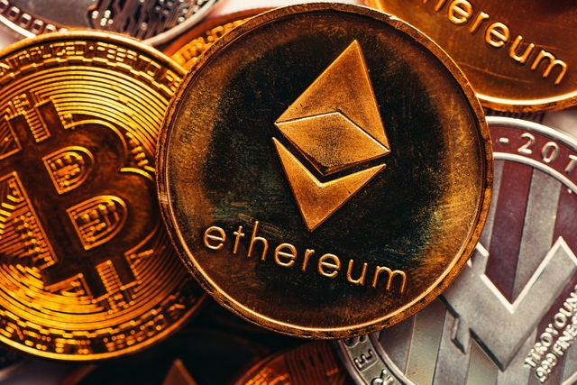

개인적으로 X를 기점으로 한 새로운 가상 화폐가 머지않아 등장할 것이라는 생각을 한다. 그것이 기존의 메인넷 위에 올라가는 토큰의 형태일지, 아니면 새로운 메인넷 위에서 동작하는 코인의 형태일지에 대해서는 확신할 수 없지만(후자에 가까울 것이라는 추측은 하고 있다. 내가 알고 있는 현 시점의 메인넷들은 가치 교환의 수단의 의미를 가진 화폐로서의 기능을 수행하기에는 너무 느리다) 등장한다면 그것이 에너지를 거래하거나, 자동차를 구입하거나, 우주 여행을 하거나, 언론을 이용할 수 있게 한다는 점에서 실질적인 가치를 지니기에 매우 유의미한 화폐가 될 것이라는 생각이다.

금과 같은 가치 저장의 수단으로서가 아닌, 달러와 같이 가치 교환 수단으로서의 화폐는 몇 가지 조건을 만족해야 성공적으로 정착할 수 있다. 적절한 수준에서의 변동성을 가져야 하며, 다른 화폐나 물건으로의 교환이 쉬워야 하며, 이 화폐의 가치를 다수가 신뢰할 수 있을 만한 담보물이 있어야 한다. 달러가 기축 통화인 이유는 절대 1강인 미국의 국방력과 경제력이 이를 담보하며, 달러를 통해서만 인류의 생존과 번영에 반드시 필요한 석유를 거래할 수 있기 때문이다.

기여와 보상이 작용하는 시스템을 하나 만들고 이 안에서 신뢰할 수 있는 화폐체계를 설계하는 것은 빠른 시일 내에 작은 단위로 전개할 중요한 일 중 하나가 될 것 같다. 보상 없이 비전과 열정만으로는 많은 사람들을 하나의 물결로 움직일 수 없기 때문이다. 점점 몸담고 있는 조직의 크기가 커져나갈수록 이는 더 가속화될 것이기에 조금 더 서둘러 보려 한다.

하나의 방향을 정하고 그 방향으로 나아가기 위한 시스템을 설계한 뒤, 이 시스템에 기여한 것에 대한 보상으로서의 화폐를 발행하고, 이 화폐를 통해 시스템 안에서의 영향력을 발휘하거나 다른 물건들로 교환할 수 있도록 하는 것. 그리고 이 화폐의 가치가 시스템의 가치에 담보되는 것을 고민하고 있다.

시스템에서 제공하는 유-무형 자산의 가치가 높아질수록 시스템 내에서 통용되는 화폐체계의 환율은 올라갈 것이다. 화폐의 가격은 언제나 상대적인 것이다. 가치를 담보하는 시스템의 가치가 하락하거나 화폐가 흔해지면 가격이 내려가고, 반대로 시스템의 가치가 올라가거나 화폐가 귀해지면 가격이 올라간다. 이는 시스템을 설계하는 자가 시스템에서 어떤 가치를 제공할 것이고, 이 가치를 획득하기 위한 화폐의 유통량을 얼마만큼으로 제한할 것인지에 따라 달라진다.

조금 더 나아가 꿈을 꿔 본다면, 인류에게 유익한 무언가 변화를 만들어 내는 데까지 생각해볼 수도 있다. 자금을 모으고, 보상체계를 잘 정돈하며 인류가 삶을 영위하는데 반드시 필요한 요소들과 이 화폐체계를 잘 결합해야 할 것 같다는 생각이 든다.

