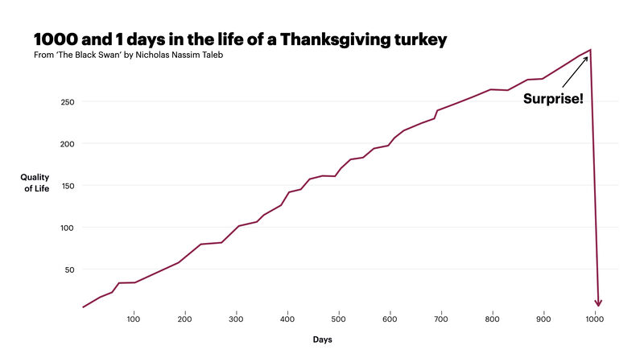

> 나는 플라톤적 태도가 복잡한 현실과 만나는 폭발성 있는 경계지대를 플라톤의 주름지대(Platonic Fold)라고 부른다. 아는 것과 모르는 것 사이의 간극이 넓어서 위험한 지점, 바로 그것이 플라톤 주름지대다. 검은 백조는 바로 이곳에서 잉태된다.

나심 탈레브의 저서 블랙 스완에서는 "플라톤의 주름지대(Platonic Fold)"에 대해 다음과 같이 이야기한다.

> 어떤 목적지와 거기에 도달하기 위한 지도를 혼동하는 경향, 즉 순수하고 정교한 형식에만 초점을 맞추는 태도를 "플라톤적 태도"라 한다. 플라톤적 태도가 우리 마음 속에 똬리를 틀고 있으면 우리는 잘 맞아 떨어지지 않는 대상이나 뭔가 깔끔하고 설명하기 어려운 것들은 도외시해 버리게 된다.
> 
> 플라톤적 태도가 우리의 이해 능력을 높여주기는 하지만, 그것이 어디나 적용되는 것은 아니다. 물론 플라톤적 형상이 존재하지 않는다는 것은 아니다. 이론틀이나 구조물처럼 현실을 지적으로 도식화한 것들이 언제나 틀린 것도 아니다. 그러나 이것들을 어떤 특정한 상황에 적용하게 되면 오류로 나타난다. 
> 
> 문제는 
> 1. 플라톤적 도식이 어디서 오류를 빚을지 사전에 알 수 없고(오류가 사실로 발생한 후에야 알게 된다) 
> 2. 이로 인한 실수가 심각한 결과를 초래한다는 것이다. 
> 
> 요컨대, 플라톤적 모델은 독극물 성분이 포함되어 있어서 매우 심각한 부작용을 일으킬 수 있는 명약이다. 
> 
> 나는 플라톤적 태도가 복잡한 현실과 만나는 폭발성 있는 경계지대를 플라톤의 주름지대(Platonic Fold)라고 부른다. 아는 것과 모르는 것 사이의 간극이 넓어서 위험한 지점, 바로 그것이 플라톤 주름지대다. 검은 백조는 바로 이곳에서 잉태된다.

몇 가지 예시들을 통해 이 예시들을 설명할 수 있는 모델을 만들고, 이후에 발생할 수 있는 미래를 이 모델을 통해 설명하려고 하는 것. 이것이 우리가 역사를 이해하는 방식이자, 미래를 예측할 때 사용하는 기본적인 형태의 도구이다. 내가 생각하기에 이 도구의 위험한 점은 "대부분의" 현상을 설득력있게 잘 설명한다는 것이다. 그리고 복잡계에서는 이 "대부분"에 속하지 않는 극단적인 몇 개의 현상으로 인해 모든 것이 무너져내릴 수 있다.

이 도구를 잘 활용하면서도 극단적인 위험들을 예방하기 위해서는 어떻게 해야 할까.
첫 번째는, 인간의 마음이 본디 이야기를 좋아한다는 사실을 인지하는 것이다. 우리는 설명 가능하며 무언가 말이 되는 것에 끌린다. 이것이 낳는 큰 위험 중 하나는 설명할 수 없는 사건들이 발생하는데도 이미 발생한 사실들을 놓고 그것을 설명할 수 있다고 믿으며, 심지어는 예측할 수도 있었다고 믿는 것이다. 더욱 심각한 것은 이렇게 제기된 설명들은 (저명하다는 사람들의 후광 효과와 함께) 논리적으로 모순이 없어보인다. 

우리의 통계적 직관은 미묘한 차이를 구분할 수 없으며(예를 들어 우리의 직관은 99%의 테러리스트들은 무슬림이라는 명제와 99% 무슬림은 테러리스트라는 명제를 쉽사리 혼동한다.) 우리의 마음은 '예견 불가능성'을 일절 용납하지 못하기 때문에 현상과 현상사이의 공백을 기지를 발휘해서 채워넣게 마련이다. 따라서 우리는 우리가 만들어낸 플라톤적 이야기에 주름지대가 존재할 수 있다는 점을 인지하고 있어야 한다.

두번째는 반 지식을 통해 진실에 다가가려는 태도를 견지하는 것이다. 플라톤의 주름지대에 빠지는 이유는 우리가 알고 있는 것 때문이 아니라 우리가 모르는 것 때문이다. 맥없는 소리라고 느껴질 수 있지만 굉장히 중요한 의미를 담고 있다고 느끼는데, 우리는 우리가 아는 것이 아닌 모르는 것에 취약하다. 플라톤의 주름지대가 생기는 이유도 우리의 플라톤적 모델이 우리가 모르는 것을 통해 만들어진 것이 아니기 때문에 이것을 설명할 수 없기 때문이다. 

반지식, 즉 우리가 모르는 것에 초점을 맞추어 블랙 스완에 노출될 기회를 최대한 늘리면, 기대 밖의 결과를 얻을 수 있으며 플라톤의 주름지대를 인지함으로써 플라톤적 모델에 무리한 베팅을 하지 않게 된다.

