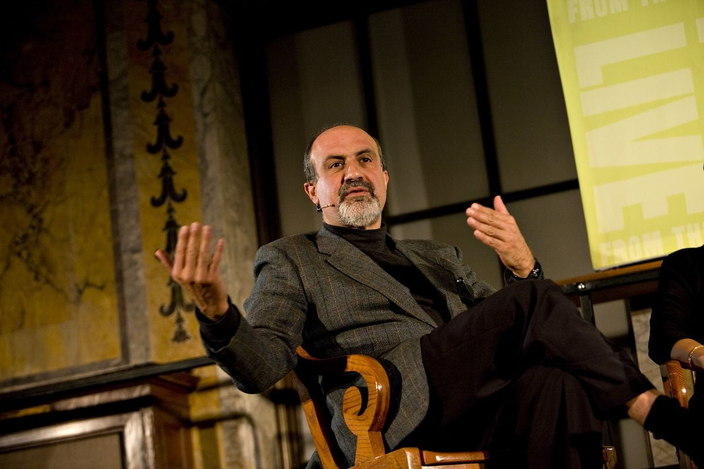

> 재물이 우리 인생에 행사하는 기능 역시 변한다. 1달러의 증가는 우리에게 약간의 풍요로움을 느끼게 한다. 하지만 2백만, 2천만 달러에 이르게 되면 재물은 더 이상 우리에게 풍요로움을 가져다줄 수 없을 뿐만 아니라 오히려 우리의 삶을 폐쇄적인 것으로 변질시키고 재물의 축적을 위해 재물의 모든 기능을 폐기시킨다. 이처럼 양질 변화는 원래 ‘좋은’ 것을 ‘나쁜’ 것으로 변하게 하고 ‘정립‘을 ‘반정립‘으로 변하게 한다. - 자본론을 읽다

독서 모임에서 자본론을 가지고 5시간 정도를 논의할 기회가 있었다. 잉여가치란 무엇인가, 공산주의는 왜 실패했는가, 착취는 어디에서 오는가, 자본주의 하에서 가난한 사람들은 왜 더욱 가난해지는가와 같은 굵직한 주제들을 두고 열띤 논의를 하다가 이야기가 막바지에 접어들 무렵, 왜 마르크스가 19세기 가장 위대한 사상가로 꼽히는가에 대한 이야기로 이어졌다.

이에 대한 주요 논점은 다음과 같았다. 
1. 사상가란 무엇인가
2. 1의 정의에 비추어볼 때, 이 시대의 사상가라고 할 만한 사람은 누구인가?

실제 논의는 2부터 시작되었고, 생각보다 칸트, 니체와 같은 사상을 펼친 사람들이 21세기에는 그렇게 많이 떠오르지 않는다는 점에서 1에 대한 논의로 넘어가게 되었다.

돌아보면 지금까지 살아오면서 누군가로부터 "사상적으로 영감을 받았다" 라는 표현을 두어 번 정도 했던 것 같다. 그 중 한 번이 블랙 스완과 안티프래질의 저자 나심 탈레브를 접했을 때이다. 학생 시절 가르침을 주셨던 여러 교수님도, 엔지니어링 관점에서 새로운 세계를 보여주었던 여러 시니어 엔지니어도 학문의 세계를 넓혀주었을지언정 나에게 사상적으로 영감을 준 것은 아니었다.

생각해보면 나에게 사상적으로 영감을 받았다는 것은 내 안에 있는 무언가가 그 사람의 사상으로 인해 박살나고 고통스러워하며 그 과정에서 새로운 무언가가 탄생하는 느낌을 받았다는 것을 의미했다. 내가 굳게 믿으면서 살아온 "정"이라는 믿음에 너무나도 강력하고 고통스러운 "반"을 제시하는 것. 이것을 받아들이는 것이 나의 뇌 배선에 너무나 많은 재배합을 요구하기에 무시하고 싶지만, 도저히 무시할 수 없는 설명을 제공하기에 받아들이게 만드는 것. 그리고 이 과정에서 "합"을 이루며 인지하지 못했던 알을 깨고 나오도록 만드는 것. 이것을 나는 사상적으로 영감을 받았다라고 표현했다.

나의 지식과 학문적 세계에 대한 확장은 고통이 아니라 즐거움에 가깝기에 정에 가속을 붙이는 행위에 가깝다면, 사상적인 영감은 정이라 믿었던 방향성 자체에 의문을 제시하며 무시할 수 없는 크기의 새로운 반을 제시하는 것이다.

벡터로 따진다면, 방향을 바꾸지 않고 크기를 더하는 행위는 배움이며, 충분히 설득력있는 크기로 다른(때로는 완전히 다른) 방향의 벡터를 내 삶에 들이미는 것은 사상적 영감이다. 그리고 나는 한번의 사상적 영감의 경험을 통해 이전으로는 돌아갈 수 없게 되었다.

사상적 영감의 정의가 이러하고, 많은 이들에게 이러한 사상적 영감을 불어넣어주는 이를 사상가라 칭한다면, 왜 이 시대에는 사상가가 없는가. 혹은 아직 이 시대가 지나지 않아서 없다고 느끼는 것 뿐인가. 후자이기를 바람과 동시에, 전자에 대해 고찰해보았다.

어쩌면 사상가가 존재하지 않기 때문이라기보다는 사람들이 믿고 있는 "정"이라는 것 자체가 모호해져버렸기 때문이 아닌가 하는 생각을 한다. 어떤 가치를 믿고 있어야 그 가치에 대해 강력한 "반"을 제시했을 때 충격을 받으며 알에서 깨어날 수 있다. 그러나 "정"이라는 것의 크기가 충분히 크지 않거나 방향 자체가 모호하다면 이것에 대해 "반"이라는 것 또한 정의하기 어려워진다. 이는 자연스럽게 포스트 모더니즘의 가장 큰 특징 중 하나와 이어지는데, 선이라는 것은 없고, 미라는 것은 없고 모든 것이 상대적인 것이다라고 정의함으로써 "정"을 정의하기 어렵게 만들어버렸다. 

이러한 상황에서 그럼에도 불구하고 사람들이 믿는 것. 그것은 우습게도 "자본"이 아닐까 한다. 어떤 정신적인 가치에 대한 "정"을 제시하기 어려운 상황에서 자본에 대해 강력한 "반"을 제시할 수 있다면, 시대가 기억하는 강력한 사상가가 될 수 있지 않을까. 

> ‘정립‘에서 ‘반정립‘으로 변해 ‘반정립‘이 일정 정도 누적되면 원래의 ‘정립‘의 가치가 다시 각도와 방식을 바꾸어 모습을 드러낸다. 우리는 언제쯤 재물의 진정한 의미에 대한 사유로 돌아갈 수 있을까? 아마도 ‘돈밖에 가진 것이 없을 정도로 가난해졌을’ 때일 것이다 - 자본론을 읽다.

