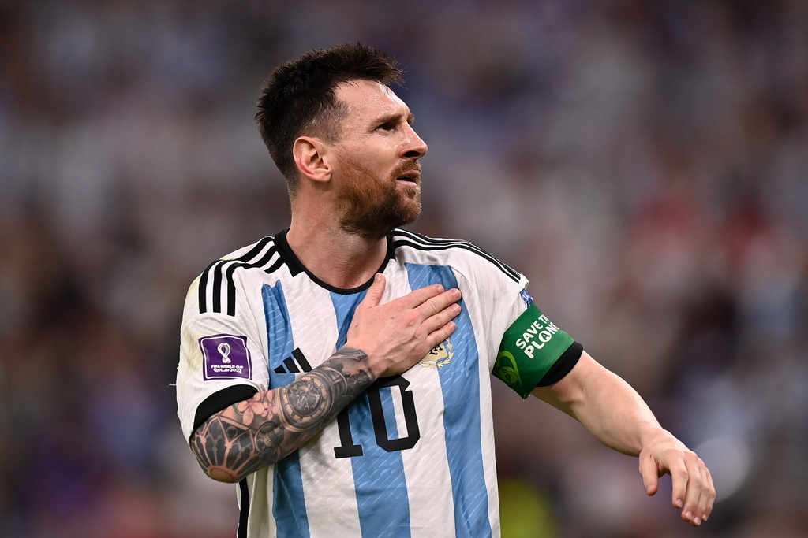

> In tennis, perfection is impossible... In the 1,526 singles matches I played in my career, I won almost 80% of those matches... Now, I have a question for all of you... what percentage of the POINTS do you think I won in those matches?
> 
> Only 54%.
> 
> In other words, even top-ranked tennis players win barely more than half of the points they play. - Rodger Federer

2022 카타르 월드컵 결승전 이후 오랜만에 라이브로 축구 경기를 시청했다. 2024 코파 아메리카 개막전 아르헨티나-캐나다 전이었다. 리오넬 메시의 경기를 관람하는 것을 워낙 좋아하기도 했고, 하이라이트가 아닌 90분의 전체 경기를 큰 그림으로 관람하는 것은 축구 외적으로도 많은 영감을 준다.

2021년 코파아메리카 우승, 2022년 카타르 월드컵을 우승한 아르헨티나와, 이번이 코파아메리카 사상 첫 출전인 캐나다와의 경기라 손쉽게 아르헨티나가 이길 것으로 예상했다. 결과만 놓고보면 2-0으로 손쉬운 승리를 거둔 것처럼 보인다. 그러나 90분 내내 관찰했던 경기 내용은 조금 달랐고, 많은 생각을 하게 만들었다.

축구는 명확한 '적'이 있고, 적에게 '승리'하기 위한 90분의 혈투가 펼쳐지며, 승리를 위한 명확한 조건이 있다. 90분이 지나 종료 휘슬이 울렸을 때, 내가 상대방보다 골망을 한번이라도 더 많이 흔들면 그 차이가 1이든 5이든 동일하게 '승리'한다. 그리고 아르헨티나는 90분 내내 '승리'하는 습관을 가진 팀이 어떤 행동들을 하는지를 명확하게 보여주었다.

## 상대를 관찰한다

전반전에는 득점이 나오지 않았다. 스칼로니 체제에서의 아르헨티나 경기를 본지가 너무 오래되어서 화끈한 공격축구를 기대했고 전반전부터 화력쇼가 펼쳐질 것이라 생각했다. 하지만 몇 차례의 찬스 미스를 제외하고는 아르헨티나는 점유율과 관찰에 집중하는 모습을 보여주었다. 오히려 캐나다에서 공격적으로 라인을 올린 나머지 뒷공간을 자주 노출했고, 결정적인 역습 찬스를 여러 번 맞이했다.

아르헨티나는 경기 내내 마치 포커를 치듯이 상대방의 반응을 떠보는 모습이었다. 스칼로니 체제에서의 아르헨티나 축구의 특징이기도 한데 점유율을 늘리고 방향전환을 자주 가져가면서 이에 대해 상대가 얼마나 반응하는지를 꽤 오래 지켜본다. 후방에서 볼을 돌릴 때, 상대가 공격적으로 나오면서 라인이 무너지는지, 아니면 대형을 유지하는지, 방향전환을 하면 어떻게 대응하는지를 보며 충분히 정보를 흡수한다. 

이번 경기에서도 전반전 92%의 패스 성공률과 66%의 점유율을 보여주면서 상대를 관찰하는 모습을 볼 수 있었고, 이에 따라 후반 눈에 띄는 몇 가지 변화들을 관찰할 수 있었다.

아르헨티나가 뒤에서 지루하게 공을 돌리면 캐나다는 대형을 무너뜨리면서 수비에게 덤벼드는 모습을 자주 노출했다. 이러한 모습이 전반전 내내 여러 차례 반복되었고, 아르헨티나는 후반전이 시작된 이후 이 부분을 집요하게 공략했다. 의도적으로 자기 진영으로 끌어들여 대형을 무너뜨리고 비어있는 뒷공간으로 긴 전진 패스를 넣는 방식으로 공격하기 시작했고, 결과적으로 3~4 차례의 1:1 찬스를 만들어냈고 이 과정에서 득점도 만들어냈다.

오늘 경기에서 아르헨티나는 집요하게 기다리며 상대를 답답하게 만들고 이 반응을 그저 지켜보며 관찰해 정보의 비대칭을 만들어냈다. 그리고 한 두 차례의 기회가 왔을 때 이 정보의 비대칭을 이용해서 결과를 만들어내는 인상적인 모습을 보여주었다.

## 의사소통 체계를 확실하게 한다

현대축구에서는 유독 자책골이 많이 나온다. 대개는 골키퍼와 수비수 사이로 애매하게 떨어진 공을 누가 처리할 것인가에 대한 커뮤니케이션 실수가 많다. 둘다 상대의 공이라고 책임을 떠넘기면 그 공간을 침투한 상대 공격수에게 실점하고, 자신의 공이라고 달려들면 자책골이 난다.

아르헨티나는 오늘 수비와 골키퍼 사이의 커뮤니케이션에서 완벽한 모습을 보여주었다. 애매하게 떨어진 공을 처리하러 나올 때는 골키퍼가 나오는 동안 수비수가 그 빈자리를 채웠고, 공을 향해 달려가는 골키퍼는 양손을 뻗어 수비수에게 이거 내 공이니까 상대나 잘 마크하라는 신호를 확실하게 주었다.

욕심과 열정만 가지고 덤벼들어서는 승리를 가져올 수 없다. 팀 플레이가 중요한 상황에서는 애매모호한 상황에 대한 확실한 의사소통 체계가 필요하다. 이는 급박한 상황일수록 더 중요하다. 무작정 공을 향해 달려갈 것이 아니라 공을 제대로 처리하지 못했을 때를 대비하고 모호한 표현들을 해소해야 한다.

## 실수를 인정하고 빠르게 커버한다

오늘 경기에서 아르헨티나와 캐나다의 결정적인 차이는 커버링에 있었다고 생각한다. 캐나다도 공 소유권을 많이 잃기는 했지만, 아르헨티나도 생각보다 많이 잃었다. 그러나 이 상황을 인지하고 반응하는 모습이 매우 달랐다.

캐나다는 선수가 드리블을 하다 공을 뺏긴 이후, 두 손을 하늘로 들어올리며 뭔가가 잘 안풀린다는 느낌으로 짜증을 내는 모습을 자주 보여주었다. 그 사이 공을 뺏은 아르헨티나 선수는 중앙선을 넘어 상대 진영 저 구석으로 공을 보냈다. 

한편, 아르헨티나는 공을 뺏기자마자 미친듯이 달려가서 태클을 하거나 동료의 커버리지를 요청해서 대부분 수 초 내로 다시 소유권을 되찾아왔다. 심지어 평균 신장이 아르헨티나 선수들이 훨씬 작음에도 불구하고 공중볼이나 소유권이 애매한 공간으로 떨어지는 공들에 대한 소유권은 거의 아르헨티나 선수들이 가져왔다. 

이 점은 시사하는 바가 크다. 실수를 하거나 일이 마음대로 안 풀릴 때, 그 상황에 집중하며 화를 내는 사람의 결과와 실수를 했을 때, 빠르게 인정하고 바로 만회하기 위해 태클을 걸고 동료의 지원을 요청하는 사람의 결과는 다를 수밖에 없다.

## 실리를 챙긴다

결국 우승하기 위해서는 승리해야 한다. 특히 토너먼트에서는 짧은 기간 동안 많은 경기를 소화해야 하고, 컨디션 관리나 부상 관리, 카드 관리등 많은 변수들도 고려해야 한다. 아름다운 장면들을 만들고 수많은 골을 쏟아부으며 관중들을 열광시키는 것도 중요하지만, 경기에서 승리하고 토너먼트에서 우승하기 위해서는 상대보다 1골만 많으면 된다. 

이 과정이 아름답고 "역시 아르헨티나야", "역시 메시야", "역시 챔피언이야" 라는 감탄을 불러일으킬 수 있다면 좋겠지만, 그렇지 않아도 승리할 수 있어야 한다. 그리고 오늘 경기를 보면서 느낀 것은 아르헨티나는 그럼에도 불구하고 승리하는 법을 아는 팀이라는 것이었다. 

승리가 매번 극적인 형태로 찾아오기는 어렵다. 그리고 치열한 경기 속에서는 승리자와 패배자가 작은 변수들에 의해 얼마든 뒤집힐 수 있다. 오늘 경기에서도 아르헨티나가 찬스를 한두 번 더 놓치고 캐나다가 찾아온 찬스를 잘 살렸다면 결과가 달랐을 수도 있다. 

악마는 디테일 속에 숨어있다. 95분이 되어 휘슬 불기 3초 전까지도 공 소유권을 되찾아오기 위해 미친듯이 달리는 아르헨티나의 데 폴의 모습, 무리해서 전진 패스를 넣을 수 있음에도 불구하고 템포를 낮추며 횡패스를 넣는 메시의 모습, 애매하게 떨어진 공에 대해서 큰 소리를 지르며 손을 흔들며 이건 내 공이라고 마크 잘하라고 뛰어오는 마르니테스 골키퍼의 모습. 이런 작은 차이들이 모여 오늘 승리를 만들어낸 것이 아닌가 싶다.

현란한 시저스 킥이나 극적인 순간에 결과를 바꾸는 결승골, 한명의 크랙이 5~6명의 수비수를 제치고 결과를 만드는 모습들은 많은 이들을 열광시키지만, 내가 사랑하는 축구는 작은 디테일들이 모여 만드는 '승리'와 더 큰 관련이 있는 것 같다. 