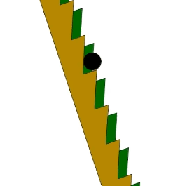

Faced with two losing games, we tend to assume the outcome is predetermined. However, in complex systems, this intuition can break down. The Parrondo's paradox illustrates this phenomenon. It states that by alternating between two individually losing games, one can achieve a winning outcome.

Viewing Parrondo's paradox through the lens of entropy provides interesting insights. Entropy measures a system's disorder or uncertainty. High entropy indicates numerous possible states, making prediction difficult. Low entropy suggests fewer possible states, allowing for more predictable outcomes. In Parrondo's paradox, each game represents a low-entropy state - a predictable loss. However, alternating between the games increases the system's overall entropy, opening up new possibilities and enabling emergent behavior.

While this seems fascinating at first glance, it reveals significant gaps in applying it to the real world.

Parrondo's paradox assumes each game is in a low-entropy state. However, in reality, many individual games have high entropy. For example, predicting the volatility of a single stock or the success probability of a business venture in a specific domain can be considered individual games, yet they possess very high entropy.

Moreover, switching between different games isn't typically easy in general situations. Human psychology makes it challenging to completely sell off one stock to increase cash holdings or to suddenly pivot from one business domain to another. These transitions often require considerable effort and resources, and sometimes may be structurally impossible.

Therefore, to apply Parrondo's paradox in the real world, we must understand it from an entropy perspective, not from the viewpoint of combining two losing games. In reality, there aren't just two games, it's difficult to combine them at will, and it's challenging to move from one game to another.

Essence of Parrondo's paradox lies in creating a system that safely allows emergent properties by combining two low-entropy states. To achieve this, two elements must be prerequisite:

1. "Entropy measurement capability"
2. "Optionality" which means "the ability to change"

According to Nassim Taleb's "Antifragile," measuring a system's entropy in complex systems is always easier than predicting the likelihood of a specific possible state occurring. Therefore, the crucial factor is the cognitive ability to recognize the need to measure your system's entropy. Recognizing is always more challenging than the measurement itself. Only after measuring the system's entropy can you proceed with steps to reduce it

For instance, in the stock market, having 100% of assets invested in Tesla represents high information entropy (assuming we can't accurately measure the stock's price and macro influences). However, a portfolio with 50% in Tesla and 50% in cash significantly lowers the system's information entropy. (This excludes a long-term investment perspective.) This provides a good option for benefiting from uncertainty. Consider a scenario where another attractive stock drops to a reasonable price.

On the other hand, optionality helps lower entropy or intentionally increase it to foster emergent properties when corporate entropy is appropriately measured. Systems lacking optionality require substantial effort to lower entropy or increase it sufficiently for emergent properties. In investments, optionality means maintaining adequate cash reserves (or equivalent liquidity). In business, as Jason Fried mentioned in his blog, it includes decision-making freedom, healthy profit margins, appropriate scale, and free expression of ideas.

Parrondo's paradox effectively illustrates the characteristics of complex systems. Here, the simple sum of individual elements fails to predict the overall outcome. The combination of two games creates new emergent properties, yielding results that cannot be predicted based on the characteristics of each game alone. Sometimes, intentionally increasing a system's entropy can open up new possibilities.

Also, compound effects are at play in complex systems,  necessitating an understanding from a geometric mean perspective rather than an arithmetic average. For instance, if you gain 30% profit one day and then lose 30% the next, while the arithmetic average suggests value preservation, you actually incur a 9% loss.

In addition to the ability to measure entropy in a system, we should strive to cultivate optionality. This combination allows us to navigate and potentially benefit from the unpredictable nature of complex systems.