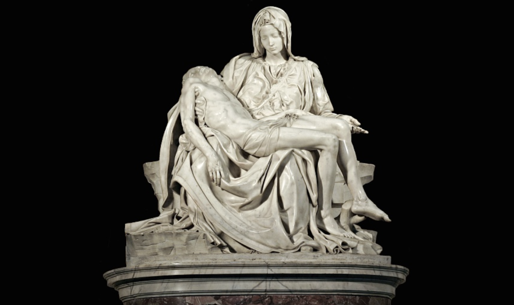

Michelangelo described his sculptural process as "discovering the form already existing within the marble and revealing it." He possessed a unique perspective, viewing marble not as mere stone, but as a vessel containing latent artwork. This philosophy is evident in works like David and Pietà, where he approached the sculpting process as if the statue were unveiling itself as he chipped away at the marble.

Michelangelo's perspective on chaotic stone gives pure insight about understanding the intelligence economy. Rather than defining the information to be extracted from chaotic data and devising specific methods to achieve this, it involves simply removing unnecessary parts of the data, allowing the information to reveal itself from the chaos.

In the intelligence economy, intelligence refers not only to the system's output but also to the process that allows information to reveal itself as it passes through the system. This differs from traditional methods of extracting information through a few useful algorithms. 

While past capitalist economies primarily focused on transforming inputs (whether material or informational) into new use-values as outputs, the intelligence economy operates differently. It will be based on the process of converting data and information into intelligence by removing chaos, creating a continuously evolving process applicable across various domains and systems. 

As this process requires human interaction, much like various historical tools, the more diverse and sophisticated the process of removing chaos to reveal information becomes, the more it will elevate human intelligence, enabling new value creation.

In the era of capitalism and information, companies like Google and Amazon transformed vast amounts of informational chaos from the internet into organized, accessible information. Amazon predicted and fulfilled customer needs using extensive customer data, while Google indexed enormous amounts of internet data to provide relevant search results. These companies created value and wealth by reducing information entropy, akin to deciding to create a "Cupid statue" from a large marble block and carving it to completion.

But with the advent of intelligent technologies, creating new processes to convert data into information and enabling their interaction with humanity seems poised to generate true economic value. We're approaching the moment when technology transcends our implementation of intelligence to become intelligent itself. This will allow us to collaborate with technology in determining what to remove from chaos and how, implying the ability to extract previously nonexistent forms from the metaphorical marble. This act represents the creation of unprecedented new value.

Now, anyone can easily create a Cupid statue from marble once the direction is set. We've entered an era where anyone can rapidly reduce entropy in a given direction. The crucial element is the process that reveals Cupid, Hermes, or Achilles from chaos. Building this process requires adding intelligence to technology, which we believe involves incorporating ontology and human interaction into technology.

Once basic needs are met, humanity focuses on added value. Historically, added value has been generated by those who first attain intelligence and monopolize additional information entropy reduction processes. This was true for those who owned machines during the Industrial Revolution and those with data and computing power in the Information Revolution. In the new era, where information entropy is expected to decrease faster than ever before, those equipped with processes to extract information from chaos will seize wealth.
