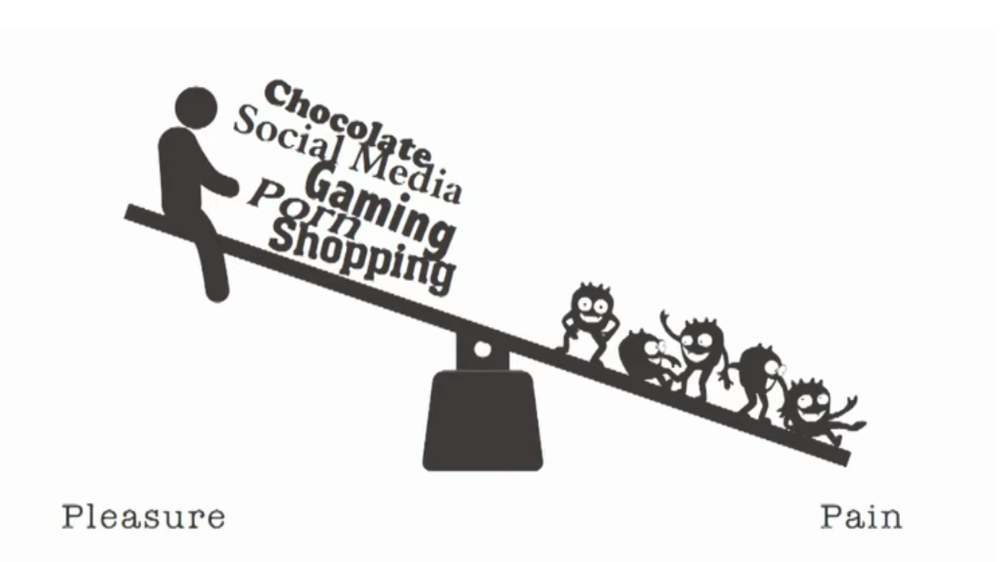

Trying to spend more time these days in a calm, unstimulating way. I've stopped wearing earphones all the time, I keep my phone far away when I'm in bed, I've cut out spicy and salty foods from my diet, and I walk short distances instead of driving. At first, I felt some withdrawal symptoms, but I felt this change was necessary for a more sustainable lifestyle in the long run.

Our brains have a reward system. When we press one side of this system through pleasurable stimuli, the brain must balance it by pressing the opposite side through pain. Like a seesaw, the bigger the stimulation, the greater the pain. While rebalancing can be uncomfortable, I thought that once the reward system tilts towards pleasure, it becomes hard to feel joy or passion unless an even greater pleasure is provided.

In nature and human life, many things happen exponentially. This usually means something grows like a snowball later, but it also means enduring an initial period where changes are barely noticeable. To endure this period, I thought we need to check our brain's reward system.

We need rewards when investing, starting a business, or doing daily tasks. These rewards should be stimulating enough to add passion and keep us going without getting tired. However, if our daily life is filled with more stimulating things, it's hard to endure the somewhat bland periods before the compound effect snowballs through these stimuli. If our brain can get bigger stimuli with less effort, why wouldn't it choose that?

In a world of compound effects, we need the strength to get through the initial boring stages. We need the power to rise again through appropriate rewards, even when walking a path with no end in sight. For this, we need to re-examine our reward system. Be mild, my friend.

