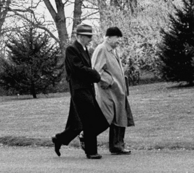

Genius isn't simply the sum of fragmented knowledge. It includes the act of integrating external knowledge within oneself. The quantity of scattered knowledge can't create additional value unless it integrates with one's internal knowledge and contributes to understanding the essence.

To make better decisions and cultivate higher levels of intelligence and genius from countless fragments of information in the world, I believe integrating new information with our internal intelligence is more important than the ability to absorb large amounts of information at once. In other words, it's about organizing a framework to see the world clearly through the integration of intelligence.

To see a blurry world clearly, we need a framework. And to build this framework, we need not knowledge but intellectual lung capacity. Intellectual lung capacity is the mental patience developed by withdrawing the desire to simplify and quickly propose solutions when facing complex problems, instead maintaining the complex state and solving it one by one like untangling a knotted thread. Those with sufficient intellectual lung capacity trim and attach knowledge that reveals complex situations to create a framework for understanding the world, and through this framework, they view the world clearly. And when knowledge appears that doesn't fit the existing framework, they boldly discard it and move to the next framework.

I write to repeat the process of going far in the journey of thought and returning without getting lost. To develop intellectual lung capacity, one must accept the world's numerous pieces of information as they are, go far, and then return, repeatedly finding new paths at certain points to venture far again. Writing helps greatly in understanding where I am and where I need to return to, because what was trapped in my world first comes out beyond it. This repetition of journeys creates critical paths for distances close to the starting point, helping to go further next time.

While we can't deny that some aspects are innate, I believe genius, from a comprehensive perspective, is cultivated. Isn't it difficult to be born with, rather than develop, the ability to create frameworks, discard them, and weave them again regardless of the field? If we define a genius as someone who can push the flow of consciousness to its limit, return to the starting point, and then concretize that thought again, writing might be one of the most efficient means of approaching genius.

