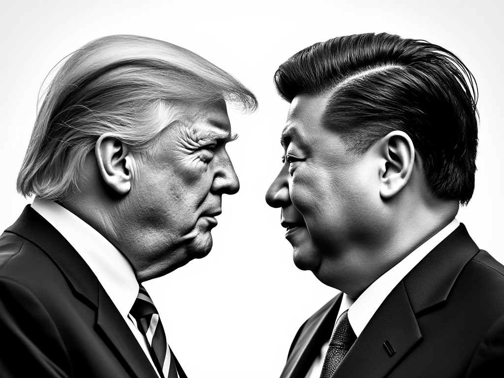

Trump's victory in the US presidential election, which had the world on edge, has concluded. While this outcome might have been surprising for those relying on legacy media, for those active on X - where real people act as both media and discussants - Trump's victory was a reasonably predictable bet (albeit nail-biting until the end).

Trump's victory has become a crucial axis in mapping out my vision for my late 20s and early 30s. Understanding this election solely through the lens of "Trump-benefiting sectors" versus "Democratic-donor risks" would miss the broader narrative of global order that will unfold over the next 5+ years. This requires a wider perspective: viewing it as the genuine start of a hegemonic war in a new Cold War era. Thus, the significance of this election lies not in the political victory between Republicans and Democrats, but in America's readiness to enter a greater hegemonic struggle.

The United States' primary concern today is maintaining its global hegemonic order - one it preserved even during the Cold War against the formidable Soviet Union. In today's context, China has become the new Soviet Union, and preventing China's "Sovietization" is the core objective. During the Cold War, America's hegemony was built on its strong manufacturing-based technological capabilities, which remains relevant today - only now with AI as an additional technological frontier. While social network companies and software providers have received high valuations over the past decade, from a national perspective, manufacturing and defense industries remain the fundamental pillars of national wealth. When it comes to hegemonic warfare between nations, few elements are more crucial than these two factors.

To maintain supremacy, America must revitalize its manufacturing base and secure AI dominance. President Trump and Vice President Vance's frequent discussions about tariffs post-election reflect a strategy to buy time and resurrect manufacturing capabilities, particularly given China's current advantage in supply chain control. The tariff card (whether actually implemented or not) is designed to gain maximum time while working toward a long-term supply chain restructuring.

From this perspective, future AI and technological hegemony is rooted in manufacturing and military equipment growth driven by hegemonic warfare. National AI dominance isn't achieved merely by developing more powerful LLMs - rather, only AI that solves Real-World problems provides an advantage in hegemonic competition. Over the next five years, this practical AI capability will become increasingly crucial from a national perspective. (As a side note, this explains why Palantir is just beginning - in the new order where Trump defends and Musk attacks, Palantir will serve as a skilled midfielder, delivering passes precisely where needed.)

A critical aspect beyond technology is regulation. Trump's election significance lies in promoting smaller government and allowing tech-savvy individuals to set regulations, preventing situations like what happened with electric vehicles. This explains why Elon Musk's entry into government shouldn't be interpreted merely as loyalty.

AI can only create true value by solving problems in the physical world, supplying necessary resources efficiently, and growing national wealth toward prosperity. Only by creating such value can a nation reclaim hegemony and maintain supremacy in the new Cold War era. I believe Trump's election has secured the first step in initiating this grand narrative.
