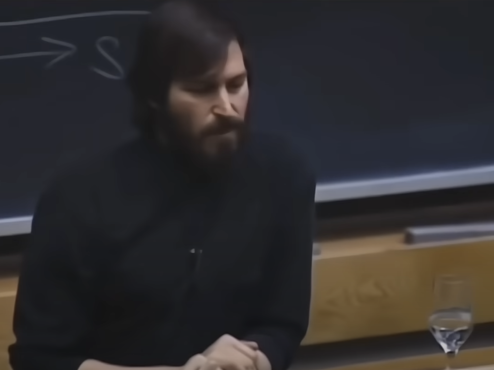

When Steve Jobs was asked at MIT in 1992, "What's the most important thing that you personally learned at Apple?" he didn't answer immediately. Instead, he paused for 18 seconds before responding. Similarly, in a 2022 interview with Lex Friedman, Elon Musk took a 21-second pause when asked, "When do you think SpaceX will land a human being on Mars?" This, along with the fact that the o1 Reasoning model showed significantly improved performance after implementing a "stop and think" feature, reminds us of the importance of dwelling on a question rather than rushing to answer.

The ability to resist the urge to immediately voice our thoughts and instead "stop and think" when faced with a question worth pondering is crucial in developing powerful thinking techniques.

Herbert Simon often said in his various works that "initial ideas aren't really ideas at all." He suggested that our first responses to questions are merely regurgitations of known patterns. These ideas come to mind first simply because they're closer to the surface of consciousness, not because they're necessarily productive thoughts. They're just what we "happen to remember" at that moment.

One of the most powerful thinking techniques we can develop is becoming comfortable with staying with a question, tolerating ambiguity, and exploring various pathways. The more we dwell on the uncertainty and keep questioning, the more useful our final answer becomes. People (or models) with the ability to stop and think can resist the urge to answer immediately, instead taking time to explore multiple possibilities before responding.

Good questions are rare. That's why when we encounter one, we need to develop the capacity to provide good answers. This requires stopping and thinking. We need to perform a kind of Monte Carlo Tree Search process: becoming less conscious of constraining social and environmental contexts, staying with the question while making choices, expanding possibilities, simulating outcomes, backpropagating, and simulating again.

