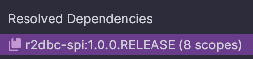

## TL; DR

여울과 댄의 Chain of Thoughts를 정리합니다. 매주 목요일 오전 8시 ~ 10시까지 기술, 경제, 사회 등의 분야를 막론한 이야기들을 주고 받습니다. 몇 가지 간단한 질문에서 시작해서 꼬리에 꼬리를 물고 시간이 찰 때까지 파헤친 기록들을 정리합니다. 

## R2DBC와 App Engine, 그리고 Transaction

Y
오늘은 우리 TF의 서버쪽에서 문제가 하나 있어서 이걸 같이 보면 좋겠다는 생각이 들었다. GCP App Engine에 떠있는 프로젝트인데 최근에 Spring Boot 3.0 버전으로 올리면서 `@Transactional` 이 제대로 동작하지 않는다. 어드민성이고 현재는 사내 몇몇 인원만 사용하고 있어서 큰 문제가 발생하진 않는데, 가끔 DB Fail이 나거나 장애가 나면 의미 없는 완전하지 못한 데이터들이 DB에 쌓여서 이걸 걷어내는 불필요한 작업들을 하고 있다. 

D
우선 시작하기 전에 사내의 Backend Stack에 대해 간략하게 설명하고 시작하는 것이 좋겠다. 현재 대부분의 서버들은 JDBC 대신에 R2DBC를 사용하고 있고, 초반에는 이슈가 많아서 Open Source Contribute도 하고 이런저런 고생을 많이 했는데, 요즘에는 어느 정도 안정화되어서 Production에서도 큰 문제 없이 잘 사용하고 있다. 

Y
이야기 나온 김에 R2DBC에 대해서 간략하게 설명해줘도 좋겠다. 추상화 단계로 보면 R2DBC와 JDBC가 같은 Layer인 것으로 알고 있고, 둘다 DB와 상호작용하는 Java API로 알고 있다.

D
JDBC는 **Java Data Base Connectivity** 의 약자이고, R2DBC는 **Reactive Relational Database Connectivity** 의 약자이다. JDBC는 데이터 베이스와의 작업을 동기식으로 수행하고 R2DBC는 Reactive Programming Model을 사용해서 비동기식으로 수행한다. 우리는 Spring Webflux를 사용하는데, 이게 코틀린 코루틴을 사용해서 요청을 비동기식으로 처리하는 방식이라 R2DBC와 궁합이 좋다. 그래서 사용하고 있다. 

Y
`build.gradle.kts` 파일을 보면서 어떤 것들이 이것들과 연관이 있는지 설명해 주면 조금 더 구체적인 레벨에서 이해가 될 것 같다.

D
`build.gradle.kts` 파일을 크게 2군데로 나눠서 설명하겠다. 우선 Dependency Resolution 하는 쪽을 먼저 이해하는 것이 좋을 것 같다.

```kotlin
...
id("org.springframework.boot") version "3.0.5"  
id("io.spring.dependency-management") version "1.1.0"
...
```

Spring Boot를 사용해서 Backend개발을 하면 편한 점은 이 `io.spring.dependency-management`가  웬만한 버전들을 다 맞춰준다는 것이다.  `build.gradle.kts` 파일의 나머지 부분들을 보면 별도로 특정 버전을 명시하지 않는데, 이것도 이 플러그인이 메타데이터들을 참조해서 잘 맞춰주기 때문이다. 이걸 이야기한 이유는 Spring Boot 3.0에서 사용하는 R2DBC SPI(Service Provider Interface) 버전은 1.0.0 이고, 아래와 같이 별도로 버전을 명시하지 않았다면 아마도 SPI 1.0.0 버전의 interface를 의존하게 될 것이다. 

```kotlin
api("org.springframework.boot:spring-boot-starter-data-r2dbc")
```

> Based on the configured dependency management metadata, the Dependency Management Plugin will control the versions of your project’s direct and transitive dependencies and will honour any exclusions declared in the poms of your project’s dependencies.
> - [Official Docs](https://docs.spring.io/dependency-management-plugin/docs/current/reference/html/)

실제로 다운로드한 의존성을 살펴보면 아래와 같이 spi:1.0.0 버전을 다운받았음을 알 수 있다. 이게 중요한 이유는 두번째 이유와 관련이 있다. 


{:width="500" :center}

두번째로 이 모든 문제의 근원인 `miku`에 대해 설명해보겠다. `build.gradle.kts`를 다시 들어가서 보면 `dev.miku:r2dbc-mysql` 이라는 의존성이 보이는데, 이 `miku`라는 의존성에 문제가 있어서 `@Transactional` 을 못쓰는 거라고 할 수 있다.

```kotlin
...
runtimeOnly("dev.miku:r2dbc-mysql:0.8.2.RELEASE")  
runtimeOnly("com.mysql:mysql-connector-j")  
implementation("io.r2dbc:r2dbc-pool")  

// cloud sql  
api("com.google.cloud.sql:cloud-sql-connector-r2dbc-mysql:1.11.0")  
...
```

Y
miku가 R2DBC 구현체중 하나라고 들었다. 그런데 QANDA의 다른 백엔드 서비스는 Spring Boot 3.0을 사용하면서 R2DBC안에서 Transaction을 잘 걸고 있는 걸로 알고 있다. 그러면 다른 백엔드 서비스들은 R2DBC의 다른 구현체를 사용하고 있는건가?

D
정확하다. 사실 QANDA의 다른 백엔드 서비스들은 `dev.miku`가 아니라 [jasync](https://github.com/jasync-sql/jasync-sql)라는 구현체를 사용한다. R2DBC의 여러 구현체들이 있는데, `dev.miku`, `jasync`, `io.asyncer`등이 있다. 그런데 구현체의 문제라기보다는 `dev.miku`가 SPI 1.0.0을 구현하지 않고 사실상 방치되고 있기 때문에 Spring Boot 3.0과의 호환이 안되는 것이다. 사실 지금 상태로 돌아가는게 신기한 상태이기는 하다. 

`dev.miku`는 2년 전부터 업데이트가 끊겼고 그래서 SPI 1.0.0을 구현한 구현체 버전이 없다. 그래서 Spring 3.0에서는 이걸 사용할 수 없는데, 그렇다면 왜 지금 이 서비스에서는 `jasync`를 안쓰는지 궁금할 수 있다. 그건 GKE안에 떠있는 다른 백엔드 서비스들과는 다르게 이 서비스가 App Engine에 떠있기 때문에 그렇다.

Y (보충 설명)
> App Engine에서 MySQL과 같은 RDB를 사용하는 경우 통상적으로 CloudSQL을 사용하는데, Managed Service인 App Engine에서 Cloud SQL에 연결할 때는 고성능 및 안전한 연결 등을 위해 내부적으로 unix socket연결을 별도로 구성해서 연결한다. 실제로 DB 연결 주소도 `r2dbc://:gcp:mysql:~~` 와 같은 구조를 갖는다.

D
이런 이유로 R2DBC 구현체라고 App engine에서 다 사용할 수 있는건 아니고 이런 연결을 지원해주는 구현체를 사용해야 한다. 아쉽게도 `jasync`에서는 App Engine 과의 연결을 지원하지 않고 있어서 사용하지 못한다.

다만 이전에 이 이슈를 고민하고 계시던 분(M이라 하겠다)께서 최근 이 부분에 대해 Contribute 해주셨고, `io.asyncer`라는 `dev.miku`를 계승하겠다라고 나타난 라이브러리가 있는데, 여기서는 App Engine에 대한 SPI1.0.0 구현체 지원이 최근에 되었다. [Pull Request](https://github.com/GoogleCloudPlatform/cloud-sql-jdbc-socket-factory/pull/1264)

그래서 `dev.miku` 대신 이걸 사용하도록 변경하면 dependency resolver가 spi 1.0.0을 구현하는 `io.asyncer`를 다운받아서 매핑해줄 것이고, 그러면 `@Transactional`을 사용할 수 있다.

## Conclusion
`dev.miku` 대신에 `io.asyncer`를 지원하도록 설정한 후에 Spring 3.0.0 + R2DBC SPI 1.0.0 을 구현한 구현체가 잘 동작해서 `@Transactional` 처리를 마무리했다.