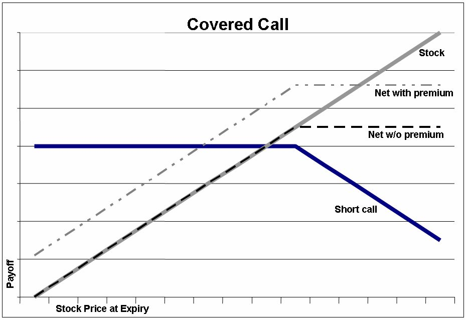
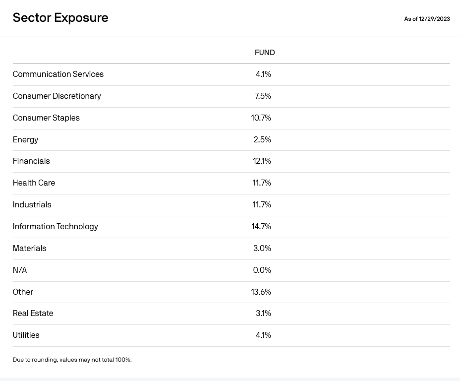
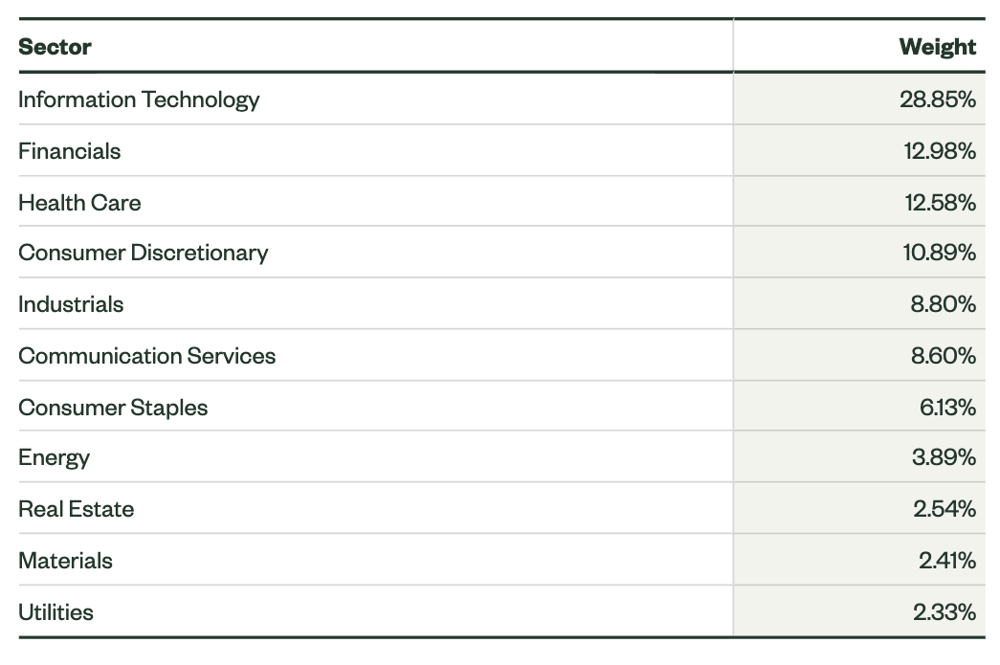

4~5년 동안 투자를 해오면서 자산 운용의 안전마진 확보를 위해 특정 Portion을 주가 등락이 그렇게 크지 않은 (개인적인 기준으로는 15% 내외) 배당주에 투자하고 있다. 배당주에 투자할 때에는 개인적으로 지키는 원칙이 있다.

1. 역사가 오래된 기업(혹은 상품)인지 확인한다. 여기서의 역사란 단순히 시간적으로 오래된 것을 포함하지만, 오직 그것만을 의미하지는 않는다. 오랜 기간 배당을 지속해 왔는가, 배당률의 등락이 어떻게 변화해 왔는가를 포함하는 보다 넓은 의미에서의 역사를 의미한다. 오랜 기간 동안 살아남은 것은 안티프래질하며, 특히 예측하기 어려운 불황이나 위기 속에서도 적정 주가를 유지하면서 배당률을 유지해온 주식은 그렇지 않은 다른 것에 비해 앞으로도 그럴 가능성이 높다. 
   
2. 배당률이 적절한 수준이어야 한다. 여기서의 적절한 수준이라는 것은 "지속가능성"을 내포하고 있다는 것을 의미한다. 지속가능하지 않은 수익구조를 가지면서 고배당을 주는 주식이나 상품에는 투자하지 않는 것을 원칙으로 하는데, 이는 배당의 본질과도 연동된다. 즉, 배당은 그 기반이 비교적 자명하고 명확한 수익모델에서부터 비롯되어야 한다. 고배당의 근원이 지나친 레버리지나 불안정성에 기초한다면 공격투자를 위한 상품으로서는 가치를 지닐지는 모르나 내가 생각하는 안정적인 배당주는 아닌 것이다.

한편, 최근 꽤 재밌는 모델을 가지고 운용되고 있는 역사가 그리 오래 되지 않은 배당주를 검토하던 중, 최종적으로 해당 종목을 24년 포트폴리오에서 드랍하게 되었다. 드랍의 이유는 위에 언급한 개인적인 투자 원칙에 어긋나며, 추구하는 핵심 가치관(Antifragility)과는 본질적으로 상반되는 방식을 통해 이익을 추구한다는 점이다. 언뜻 보기에는 꽤나 안전해보이지만, 검토하는 과정에서 드러난 Fragility와 이것에 대한 고찰 과정이 흥미로워 몇가지 부분을 정리해보려 한다.

## JEPI
검토했던 주식 중 하나는 JPMorgan Equity Premium Income ETF(JEPI)로, 9~10% 대의 고배당을 토대로 많은 투자자들을 끌어모았던 JP Morgan의 배당성 ETF다. 자산은 2023년 기준 대략 200억~300억 달러 이상으로 유동성도 괜찮고, 액티브 펀드인 점을 감안하면 0.35%의 운용 수수료도 꽤 합리적으로 느껴진다. (대표적인 액티브 펀드 중 하나인 ARKK는 운용 수수료가 0.75%이다.) 

주목할 만한 점은 "고배당"을 지급하면서 "리스크에 강한 것"처럼 보이는 최근의 성과이다. 최근 연배당률은 12%에다가 월배당 구조라 매달 계좌로 높은 수준의 월 배당금이 입금된다. 게다가 같은 기간 대표적인 S&P500 추종 ETF인 SPY가 -8.7% 가량의 수익률을 보인 반면, JEPI는 -1.67%를 기록해서 위기에도 적정 수준의 하방을 지키는 듯한 모습을 보여주었다. 

일반적으로 지수 추종 펀드의 배당은 해당 펀드가 투자한 주식의 배당에 운용 수수료를 제한 것으로 결정되며, 대개 연 1~2% 수준으로 결정된다. JEPI는 이러한 주식 배당에 더불어 Covered Call 이라는 방식을 사용해서 추가적인 수익률을 만드는데, 이 방식이 매력적인 것으로 보이나 자세한 내역들을 살펴보면 개인적으로 구조적인 Fragile을 포함하고 있다고 느끼는 부분이기도 하다. 특히 JEPI가 Covered Call 을 활용하고 있는 방식을 보면 더욱 그렇다.

## Covered Call
Covered Call 이란 JEPI 뿐 아니라 다른 ETF들에서도 종종 사용하는 전략으로, 주식을 매수하면서, 동시에 콜 옵션을 매도하는 방식으로 운영 펀드에 프리미엄을 더하는 전략을 의미한다.

예를 들어, A라는 액티브 펀드가 Covered Call 방식을 사용해서 배당률을 극대화 하기 위한 전략을 갖고 운용한다고 이야기해보자. 이해를 돕기 위해 A펀드의 자산은 애플 주식 하나로만 구성되어 있다고 가정하겠다. 

A펀드는 $100에 주식을 매수함과 동시에 $110의 행사 가격을 가진 매도 옵션을 판매한다.($2에 판매한다고 가정하자.) 즉, $100에 주식을 50주 매수한뒤 해당 옵션을 모두 판매했다면 A 펀드는 $100짜리 주식으로부터 얻는 수익 이외에, $2 * 50 에 해당하는 옵션 프리미엄 또한 수익으로 얻게 되는 것이다. 만약 주가가 행사 가격 미만에서 횡보하거나 하락할 경우, 해당 옵션의 구매자는 옵션을 행사하지 않을 것이므로 A펀드는 프리미엄을 고스란이 운용 수익으로 가져가게 되며, 이는 주가가 하락했을 때도 주가 하락분을 메워주는 역할을 한다. 

이런 Covered Call 방식의 수익구조는 주가가 적정 수준에서 횡보할 때 가장 효과적인 수익을 내는데, 기본적으로 수익을 얻는 방식의 비중이 보유한 주식에 대한 상승분이나 배당보다, 콜 옵션을 매도함으로써 받는 프리미엄에 쏠려있기 때문이다. 만약 연준이 추가적인 금리 인하를 시사하거나 어닝 서프라이즈 등으로 펀드의 보유 주식의 주가가 급등한다면, 추가분에 대한 이익을 펀드로 가져올 수 없게 되며, 손실을 보고 팔아야 한다. 이 경우에는 단순히 해당 주식을 보유하고 있는 펀드들이 더 높은 수익률을 가져오게 될 것이며, 하방압력과 상방압력이 바람직하지 않은 방향으로 비대칭성을 띄게 된다.

## Fragility
Covered Call 옵션을 사용한 JEPI는 근 3년동안(2020년에 출범한 신생 펀드이다) 좋은 운영 실적을 보여주었고, 결과적으로는 BlackRock과 같은 다른 자산 운용사들도 비슷한 형태의 액티브 펀드를 낼 만큼 인기를 끌었다. 하지만 개인적으로는 이 Covered Call 방식에 대한 Fragile과, JEPI가 Covered Call을 다루는 방식에 대한 Fragile이 맞물려, 적어도 2024년에는 포트폴리오에 넣지 않기로 했다.

### Covered Call Fragility
추상적인 레이어에서 "다양한 종목들로 구성된 포트폴리오"라는 말을 들으면 리스크를 헷징하기 위한 좋은 수단을 보유한 것처럼 보인다. 하지만 실제로 JEPI의 섹터별 포트폴리오 구성을 보면 다음과 같다. 

13.6%를 차지하는 콜 옵션 매도 부분을 제외하면, IT 부분의 Sector 비중이 14.7%로, S&P 500을 추종하는 대표적인 펀드인 SPY가 대략 28.9% 정도의 Sector 비중을 차지하는 것에 비해 낮은 비중을 보유하고 있으며, 오히려 소비재 부문(Consumer Staples)이 10.7%로 6.13% 정도의 SPY보다 높은 것으로 보인다.

이러한 비대칭성은 JEPI가 콜 옵션을 매도하는 방식에 의해 더 커지는데, 자신이 보유한 주식의 비중만큼 콜 옵션을 판매하는 것이 아닌 ELN(Enhanced Liquidity Note), 즉 주가연계증권을 사용해서 콜 옵션 매도의 효과를 가져오는 것인데, 이 ELN이 타겟하는 것은 개별 주식이 아니라 SPX, 즉 S&P 500의 지수를 추종한다.

즉, JEPI는 소비재 비중이 상대적으로 높고, 기술주 비중이 상대적으로 낮은 개별 주식을 보유하면서, 소비재 비중이 상대적으로 낮고, 기술주 비중이 상대적으로 높은 S&P 인덱스를 따르는 주가 연계형 증권을 사용해서 콜 옵션 매도를 하는 구조인 것이다. 이러한 구조에서는, 지금 시점과 같이 소비재가 상대적으로 강하고, 기술주가 약한 지금의 시장에서는 비교적 괜찮은 수익을 거둘 수 있지만, 반대로 기술주가 상대적으로 강해지는 상황에서는 오히려 보유한 주식보다 높은 비중의 콜 옵션매도로 인한 fragile이 터질 수 있는 위험성이 존재한다. 이렇게 "자기가 들고 있지 않은 주식에 대해 정확하게 Covered Call을 구현하고 있지 않은 지금의 상황"이 JEPI의 내재된 프래질 중 하나인 것으로 판단된다. (물론 2명의 경험있는 펀드매니저가 적절하게 자산 비중을 조절하는 것으로 보인다. 실제로 2023년 3월에는 기술주 비중이 지금보다 훨씬 더 낮은 10% 초반이었다.)

또한, Covered Call 자체도 내가 갖고 있는 안티프래질적인 직관과 정확히 반대되는데, 옵션을 "매도"함으로써, 향후 얻을 수 있는 비선형적인 이익을 포기하고, 옵션을 판매하는 것에서부터 오는 프리미엄을 이익으로 생각하기 때문이다. 물론 지금과 같이 특정 상황에서 횡보하는 시장이라면 설득력있는 접근인 것은 맞지만, 일단 투자한 뒤 어느 정도의 Antifragility를 확보하고, 이따금씩 들어와 포트폴리오를 확인하는 내 개인적인 투자방식과 맞물린다면 "내가", "JEPI를 투자하는" 행위는 Fragile 한 방식이다.

### Time Fragility
금융위기, 코로나19등등 블랙스완과 같은 상황들로부터 살아남아 지속적으로 배당과 성장성을 유지했느냐에 대해서도 JEPI는 확인되지 않은 fragile을 갖는다. 2020년 5월, 즉 한창 코로나의 충격으로부터 회복하는 시점에 생성된 펀드이기 때문에 상방과, 하방의 급격한 움직임에 어느 정도까지 대응할 수 있을지에 대한 우려가 존재한다.

일례로, 개인적으로 비중을 두고 4년 넘게 보유하고 있는 리얼티 인컴(O)를 투자하게 된 결정적인 이유는 1994년 상장이후 숱한 위기들을 넘겨왔다는 점, 그 위기들을 넘겨오면서도 연 평균 4회 이상씩 배당을 인상해 왔다는 점, S&P 500에 편입될 만큼 안정적인 BM을 유지해 왔다는 점이다. 

개인적으로 두고 있는 배당주의 포지션은 "배당률이 높은가" 이외에, "현금 보유의 일부분을 대신할 정도로 안정성이 있는가"에 가깝기 때문에, JEPI의 고배당률이 리얼티 인컴의 이러한 Antifragility를 넘어설 만한 매력으로 다가오지 않았던 것 같다. 

## Conclusion
이 글은 지극히 개인적인 관점의 글이다. 앞서 언급했듯, 이 글의 내용이 "JEPI가 프래질하기 때문에 투자해서는 안된다" 라는 관점으로 결론지어지지 않았으면 한다. 개인적으로 배당주를 대하는 방식에 대한 맥락 정보가 JEPI의 Covered Call 운영방식의 비대칭성과 어우러져, 이번 검토에서는 누락되었고, 그것에 대한 이야기를 풀어나가는 과정이 이 글을 통해 말하고 싶은 바이며, 매우 높은 추상화 수준에서 "Covered Call 사용", "Black Rock 도 비슷한 ETF를 출시함", "지수 추종 펀드", "고배당 지속됨"과 같은 키워드들의 이면으로 들어가 실제로 이 수치들이 매크로와 어우러져 만들어내는 의미는 무엇인지, 근본적으로 가질 수 밖에 없는 Fragile은 무엇인지를 탐구하려는 시도에 가깝다.

## Reference

- https://am.jpmorgan.com/us/en/asset-management/adv/products/jpmorgan-equity-premium-income-etf-etf-shares-46641q332#/portfolio
- https://www.ssga.com/us/en/intermediary/etfs/funds/spdr-sp-500-etf-trust-spy