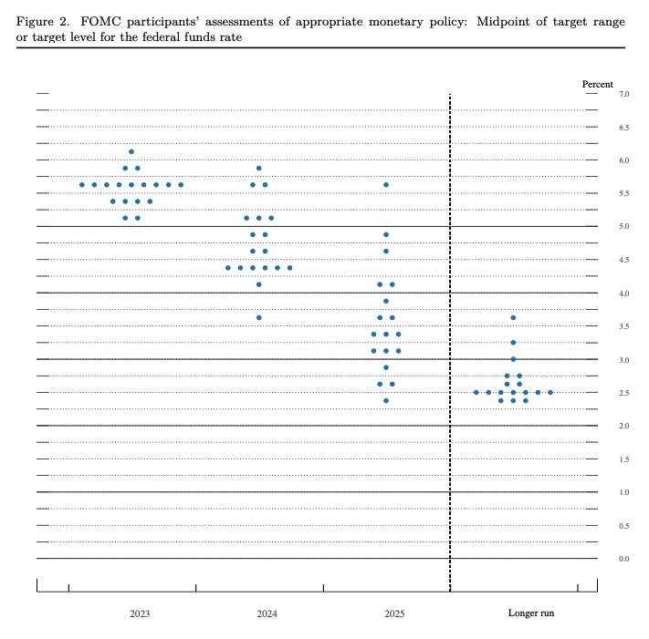

---  
share: true  
toc: true  
categories: [Economics]  
tags: [economics, essay, fomc, dollar]  
layout: post  
title: "FOMC Review (23.06)"  
date: "2023-06-19"  
github_title: "2023-06-19-FOMC Review (23.06)"  
---  
  
  
## Quotes  
  
today we decided to leave our policy interest rate unchanged and to continue to reduce our securities holdings. Looking ahead, nearly all Committee participants view it as likely that some further rate increases will be appropriate this year to bring inflation down to 2 percent over time.  
  
the median projection has real GDP growth at 1.0 percent this year and 1.1 percent next year, well below the median estimate of the longer-run normal growth rate.  
  
The median unemployment rate projection in the SEP rises to 4.1 percent at the end of this year and 4.5 percent at the end of next year.  
  
Inflation remains well above our longer-run 2 percent goal. Over the 12 months ending in April, total PCE prices rose 4.4 percent; excluding the volatile food and energy categories, core PCE prices rose 4.7 percent.  
  
  
## Thoughts  
  
이번 6월 FOMC에서 제롬 파월 연준 의장은 추가적인 기준금리 인상 없이 동결을 선언했지만, 그것이 인플레이션 문제가 해결되었다고 판단한 것이 아니라 이후 있을 추가 금리 인상을 위한 숨고르기임을 언급했다  
> some further rate increases will be appropriate  
  
이에 따라, 연말의 기준 금리 수준은 현재 수준의 기준 금리(5.0~5.25)에서 최대 50bp가 오른 5.5~5.75% 정도가 될 것으로 예상되며, 연준의 인플레이션 목표가 2%이고, 이를 위해서는 여기서 멈추면 안된다는 기존의 스탠스를 수정하지 않았다는 것으로 해석할 수 있다.  
  
금리 동결과 더불어 이번 FOMC에서는 몇 가지 지표들을 언급했다.  
- 지난 3월 0.4%로 전망했던 올해 성장률 전망치를 1.0% 로 상향 조정했다.  
  >the median projection has real GDP growth at 1.0 percent this year  
  
- 실업률 전망이 기존 4.5%에서 4.1%로 낮아졌다.  
>The median unemployment rate projection in the SEP rises to 4.1 percent at the end of this year  
  
- 헤드라인 물가는 3.3% 에서 3.2%로 전망치를 낮추었지만, PCE는 되려 3.6%에서 3.9%로 전망치를 높였다.  
>The median projection in the SEP for total PCE inflation is 3.2 percent this year, 2.5 percent next year, and 2.1 percent in 2025. Core PCE inflation, which excludes volatile food and energy prices, is projected to run higher than total inflation, and the median projection has been revised up to 3.9 percent this year.  
  
이들을 종합해보면, "금리를 5%가량 급하게 인상했음에도 불구하고 고용은 탄탄하고, 성장은 그렇게 많이 훼손되지 않았으며, 오히려 Core 인플레이션이 내려오는 속도는 줄어들지 않았기 때문에 추가적인 인상이 필요할 것으로 보인다" 정도로 해석할 수 있을 것이다. 이에 따라 높은 확률로 7월에 열리는 다음 FOMC에서는 25bp의 기준 금리 인상이 예상된다.  
  
  
  
한 가지 흥미로운 부분은 100%의 연준의원들이 올해 말까지 기준 금리가 5%위로 높게 유지된다고 생각하고 있으며, 과반 이상의 연준 의원들이 내년 말까지도 기준금리를 4.5% 이상으로 보고 있다는 것이다.   
  
이 부분에 주목해야 하는 이유는 미국이 아니라 미국의 Pivoting을 기대하며 YCC를 지속하고 있는 BOJ와, 현재 미국과 금리차가 상당수 벌어져 있는 대한민국, 영국등과 같은 타 국가들간의 금리차 때문인데, 통화간 금리차가 크게 벌어지게 되면 발생할 수 있는 여러 Side Effect 들이 새로운 정치적인 이슈를 만들어낼 수 있기 때문이다. 이 부분은 조금 더 지켜보아야 할 것으로 보인다. 개인적인 생각으로는 이런 상황에서 일본이 얼마나 오랜 기간 YCC를 지속할 수 있을지도 의문이다.  
  
  
## Reference  
- https://www.federalreserve.gov/mediacenter/files/FOMCpresconf20230614.pdf  
- https://www.federalreserve.gov/monetarypolicy/files/fomcprojtabl20230614.pdf