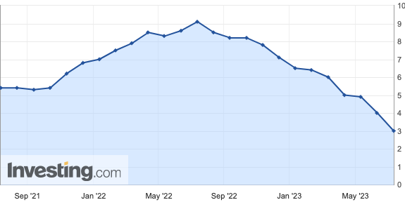
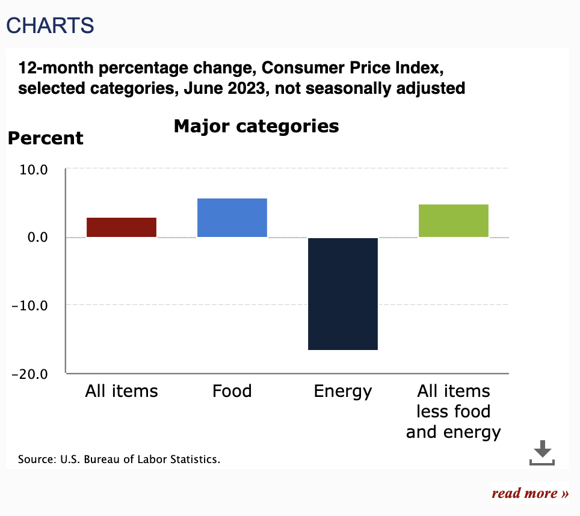

## Thoughts


2023년 6월 소비자 물가지수(CPI)가 시장 예상치를 하회한 3.0으로 발표되었다. 이로서 CPI는 작년 22년 6월 9.1%로 정점을 찍은 뒤 꾸준히 하락세를 보이고 있다. 고무적인 건, PCE(Personal Consumption Expenditure)가 지난달 5.3%에서 큰 폭 하회한 4.8%가 찍혔다는 것이다. 이를 인플레이션 둔화 시그널로 해석함에 따라 시장에서는 물가 안정에 대한 기대가 생겼고, 장단기 금리가 모두 하락하며 달러 약세로 장을 마감했다.

한 가지 흥미로운 건, 달러가 약세로 전환하면서 원자재 가격이 상대적으로 상승했고, 배럴당 65달러 정도 선에서 거래되던 원유가 74달러정도로 튀어올랐다는 것이다. 9.1%의 높은 물가상승률을 빠르게 끌어내린 주요 요인 중 하나가 달러 강세에 따른 원자재 가격의 하락이었는데, 아이러니하게도 물가가 안정화될 조짐이 보이니 달러가 약세로 전환되어 원자재 가격이 다시 슬금슬금 올라오고 있는 것이다. 

이러한 연유로 인플레이션이 수치상으로 확실하게 둔화되고 있음에도, 연준에서는 경계 테세를 늦추지 않고 높은 기준금리 수준을 유지하면서 올해 안으로 두 차례 이상 추가로 금리를 인상하는 방안에 대해 어느 정도는 기정 사실화 하고 있다. 

5%대의 높은 금리 수준에서도 미국의 성장은 크게 무너지지 않았고, 고용도 여전히 탄탄하며 올 상반기쯤 예상되었던 경기침체의 신호도 보이지 않음에 따라 연초만 하더라도 2.5% 수준으로 논의되던 중립금리 수준을 높이는 것이 적절하다는 연준 의원들의 발언이 계속되고 있다. 개인적인 생각으로는 중립금리에 대한 기대치를 높이면서 높은 수준의 금리를 상당히 장기간 지속해야 한다고 생각하는데, 지금의 상황이 1980년대 폴 볼커가 했던 실수를 그대로 반복하기 쉬운 상황이라 여겨지기 때문이다. 볼커의 실수를 언급한 기사의 일부를 인용한다.

> **볼커의 실수**  
> 볼커는 1979부터 8월부터 1987년 8월까지 8년간 연준 의장으로 재임하면서 두 차례 오일쇼크 등에 따른 만성 인플레이션을 잡았다. 하지만 그 과정이 순탄했던 것은 아니다. 볼커가 취임한 1979년 8월 소비자물가 상승률은 전년 대비 11.8%였다. 이 수치는 1980년 4월까지 8개월 동안 14.5%로 2.7%포인트 상승했다. 볼커는 취임하자마자 인플레이션 전쟁을 시작, 같은 기간 동안 실효기준금리를 8.0%에서 17.6%로 9.6%포인트나 확 올렸다. 기준금리가 물가상승률보다 높아지면서 1980년 여름에 인플레이션 압력이 약해졌다. 
> 
> 그러자 볼커는 그해 7월에 실효기준금리를 9%대로 대폭 낮췄다. 2년 만에 가장 낮은 수준이었다. 하지만 착각이었다. 인플레이션은 약간 완화되기는 했지만 여전히 12%를 웃돌았다. 볼커는 자신의 자만을 깨닫고 다시 금리를 올리기 시작했다.

물가가 9.1%에서 3%로 1년만에 상당 부분 하락한 것은 많지만 이를 액면 그대로 받아들이기에는 조금 위험한 감이 있다. 아래 그림과 같이 이번 CPI 지표를 상세하게 뜯어보면 인플레이션의 하락세는 에너지가 주도했으며 에너지를 제외한 나머지 항목들에서는 여전히 상당한 상승세를 보여주고 있다. 

또 하나 주목할만한 점은 위에서 언급한 것처럼 CPI 하락에 따른 연준에 대한 피벗 기대감이 불러온 달러 약세인데, 이 달러 약세가 CPI를 끌어내린 주요 요인인 원자재 가격을 다시 끌어올릴 가능성이 보이기 때문이다. 현재 시장의 대부분의 Greedy한 지표들은 연준의 피벗 기대감을 기준으로 움직이고 있기 때문에 CPI를 통해 확인한 인플레이션 둔화율만을 가지고 완화적인 태도로 돌아서게 된다면 80년대 볼커가 저지를 실수를 반복하면서 인플레이션을 2~3년 더 길게 끌고갈 가능성이 높다. 

{: width="500"}

7월 FOMC가 2주 뒤에 있다. 지난 6월 FOMC에서 파월 의장이 2번 정도(혹은 그 이상)의 금리 인상이 적절하다고 생각한다고 발언했기 때문에 시장은 이번 FOMC에서 금리를 0.25% 올릴 것으로 예상하고 있다.(90%로 보고 있음.) 이후 8월달에는 잭슬홀 미팅이 있는데, 작년 이맘때쯤 파월이 "인플레는 일시적이다"라고 말하며 큰 실수를 저지른 기억이 있기 때문에 이번 잭슨홀 미팅에서 현재의 상황을 얼마나 긴축적으로 묘사하며 피벗 기대감을 낮출 것인지를 주목해 볼 필요가 있다.

## Reference

- [https://kr.investing.com/economic-calendar/cpi-733](https://kr.investing.com/economic-calendar/cpi-733)
- [https://www.bls.gov/cpi/](https://www.bls.gov/cpi/)
