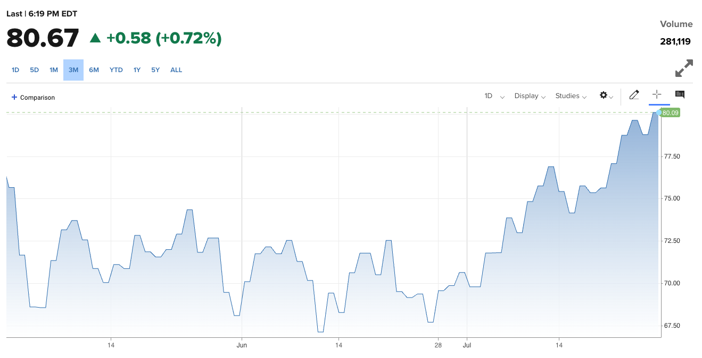

---  
share: true  
toc: true  
categories: [Economics]  
tags: [economics, essay, fomc, dollar]  
layout: post  
title: "FOMC Review (23.07)"  
date: "2023-07-29"  
github_title: "2023-07-29-FOMC Review (23.07)"  
---  
  
## Quotes  
  
Today, we took another step by raising our policy interest rate 1/4 percentage point, and we are continuing to reduce our securities holdings at a brisk pace. We have covered a lot of ground, and the full effects of our tightening have yet to be felt.  
  
Looking ahead, we will continue to take a data-dependent approach in determining the extent of additional policy firming that may be appropriate.  
  
The labor market remains very tight. Over the past three months, job gains averaged 244 thousand jobs per month, a pace below that seen earlier in the year but still a strong pace. The unemployment rate remains low, at 3.6 percent.  
  
Inflation has moderated somewhat since the middle of last year. Nonetheless, the process of getting inflation back down to 2 percent has a long way to go. Despite elevated inflation, longer- term inflation expectations appear to remain well anchored  
  
We're going to be going meeting by meeting, and as we go into each meeting, we're going to be asking ourselves the same questions. So we haven't made any decisions about any future meetings  
  
We'll be looking at inflation, we'll be asking ourselves; does this whole collection of data, do we assess it as suggesting that we need to raise rates further? And if we make that conclusion, then we will go ahead and raise rates. So that's how we're thinking about the next meeting  
  
  
## Thoughts  
  
이번 7월 FOMC에서 연준은 시장의 예상에 부합하게 25bp의 금리 인상을 단행했다. 모두가 예상했던 인상이니만큼 이에 대한 이견은 없어보이지만, 이후에 논의된 여러 경제 지표들과 연준의 스탠스는 주목할만하다.  
  
우선 연준에서는 25년까지 인플레이션이 2%로 하락하지 않을 수 있다고 내다봤으며, 현재 보여주는 탄탄한 고용등으로 미루어보았을 때 올해 경기 침체를 예상하지 않고 있는 것으로 보인다.   
  
한편 관련해서 눈여겨보아야 할 여러 지표들이 있다.  
우선 최근 인플레이션 하락세를 주도한 원자재의 가격이 달러 약세와 함께 다시 상승세에 돌입했다는 것이다. 국제 유가는 작년 6월말 배럴당 140불 까지 올라갔다가 65달러로 빠르게 내려와주면서 인플레 하락세를 주도했지만, 최근 80달러를 돌파하면서 다시 빠르게 올라오고 있다. 이 국제유가의 상승분만큼 서비스 물가나 노동임금의 상승이 둔화되지 않는다면 인플레이션이 다시 저점에서 꼬리를 말고 튀어오를 수 있다.  
  
이 지점을 변수로 여겼기 때문인지는 모르겠지만, 이후 미팅에서 추가적인 금리 인상이나 연준의 스탠스가 어떻게 변할 것 같냐는 질문에 제롬 파월 연준 의장은 매 미팅마다 데이터를 보고 결정할 것이라는 코멘트를 남겼다. 즉 작년과는 다르게 별도의 포워드 가이던스를 주지 않고, 데이터를 보고 그때그때 결정할 것이므로 추가적으로 금리를 인상할 가능성이 있음을 사실상 인정한 것이나 다름없다.  
  
> We're going to be going meeting by meeting, and as we go into each meeting, we're going to be asking ourselves the same questions. So we haven't made any decisions about any future meetings  
>   
> We'll be looking at inflation, we'll be asking ourselves; does this whole collection of data, do we assess it as suggesting that we need to raise rates further? And if we make that conclusion, then we will go ahead and raise rates. So that's how we're thinking about the next meeting  
  
주택가격이 반등세를 보이고 있고, 국제유가가 빠른 속도고 반등하고 있는 현 상황에서 임대료, 서비스, 노동임금, 중고차 가격등의 지표들이 어떻게 나오는가에 따라 이후 3차례의 추가적인 FOMC에서 금리를 인상할 가능성이 있고, 올라간 높은 금리 상황을 상당히 오랜 시간동안 (적어도 24년 말까지는) 유지할 것으로 보인다.  
  
  
  
또 한가지 주목해보아야 할 것은 미국의 국채금리와 일본이 YCC 상단 조정에 대한 것이다.  아래에 인용한 것과 같이 BOJ에서 YCC 상단을 기존 0.5%에서 1%로 올렸다. 이전에 미국이 높은 수준의 금리를 장기간 유지함에 따라 피벗 기대감이 사라지면서 일본의 인플레이션과 엔저 압박이 강해지고 있고, 일본 입장에서는 바로 긴축적인 기조로 전환하기 어렵기 때문에 YCC 상단을 서서히 끌어올리면서 긴축에 대한 준비를 하게 될 것이라는 이야기를 한 적이 있었는데, 생각보다 빠른 시점에 YCC 상단 조정이 일어났다.  
  
> In its [policy statement, the BOJ](https://www.boj.or.jp/en/mopo/mpmdeci/mpr_2023/k230728a.pdf) said it will continue to allow 10-year Japanese government bond yields to fluctuate within the range of 0.5 percentage point either side of its 0% target — but it will offer to purchase 10-year JGBs at 1% through fixed-rate operations. This effectively expands its tolerance by a further 50 basis points.  
  
가뜩이나 중국이나 러시아, 볼리비아 같은 국가들이 미국 국채를 마구 팔아대고 있고, 미국은 디폴트를 막기 위해 8월중에 1조 달러의 대규모 국채를 발행해야 하는 상황에서 일본 국채 금리가 1%대로 상승하면서 엔캐리 트레이드 청산 가능성까지 높아지게 된 것이다.(물론 이 글을 쓰는 지금 이 시점에는 청산 가능성이 그리 높지 않다는 기사가 나오고는 있지만 조금 더 지켜보아야 하지 않을까 생각한다.) 전반적으로 시장에 달러가 많이 풀리면서 수요보다 공급이 높아지고 있는 느낌이다.  
  
정리하면, 25bp 금리 인상을 했지만, 지표에 따라 이후 FOMC에서 추가적인 금리 인상을 단행할 가능성이 생겼으며(개인적으로는 높다고 생각함.) 현재의 인플레 둔화를 만든 원자재가격이 다시 상승하고 있기 때문에 다른 쪽에서 이를 상쇄할 만한 하락세가 나오는지를 지켜보아야 할 것이다. 추가로, 전반적인 세계경제 추세에서 달러의 수요보다 공급이 많아지고 있는 느낌이라 미국 장기 국채의 가격이 빠른 속도로 내려오지 않을까 하는 생각이다.  
  
## Reference  
  
- [FOMC Trascript](https://www.federalreserve.gov/mediacenter/files/FOMCpresconf20230726.pdf)  
- [BOJ YCC Control](https://www.boj.or.jp/en/mopo/mpmdeci/mpr_2023/k230728a.pdf)  
