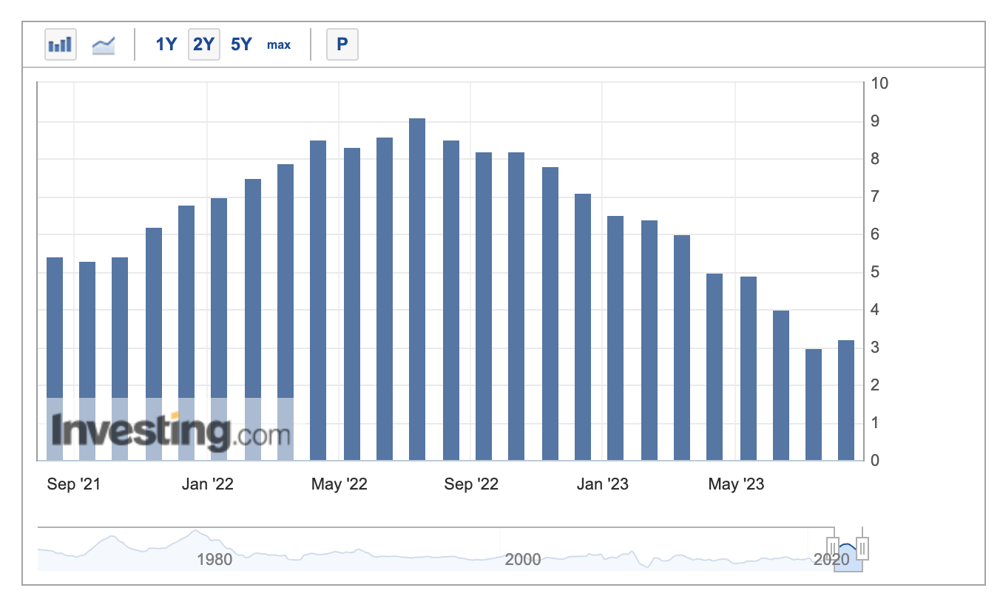
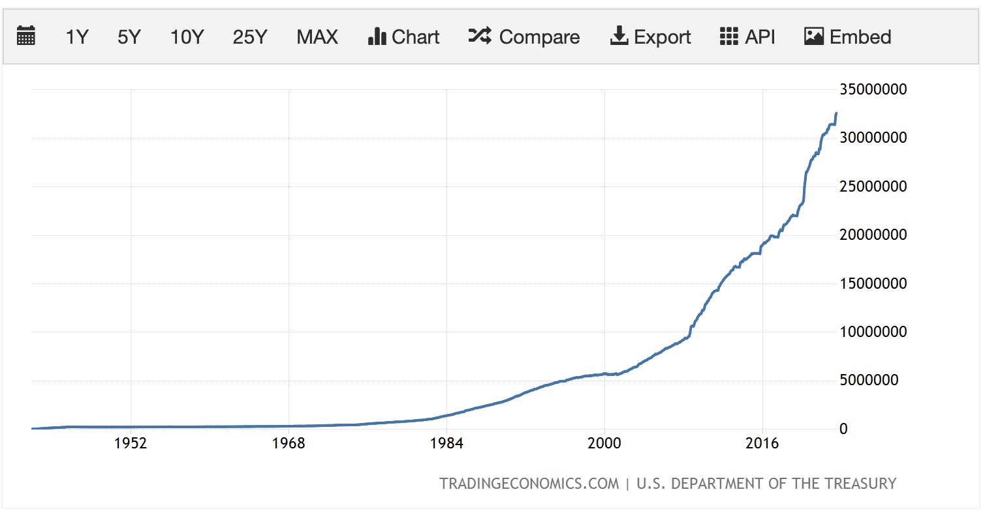

## CPI Review

{: width="500"}

8/10일 7월 미국 CPI(Consumer Price Index)가 나왔다. 시장은 원유 등 원자재 등의 이슈로 3.3% 대로 올라갈 것으로 예측했고, 3.2%로 예상치보다는 다소 떨어진 수치가 나왔다.

하지만, 6월 CPI가 3.0으로 최저점을 찍었다는 점에서 인플레이션이 다시 꼬리를 말고 올라가고 있는 것으로 해석할 수도 있을 것 같다. 다만 [CPI를 구성하는 세부 항목](https://www.bls.gov/news.release/pdf/cpi.pdf)들을 보면 집값이 상당히 높은 부분을 차지하고 있는데, 이전 FOMC에서 집값이 곧 내려갈 것 같다라는 언급을 한 바가 있어서 시장에서는 생각보다 괜찮은 지표가 나왔다고도 해석하고 있는 것으로 보인다.

주의깊게 보아야 할 것은 에너지중 가장 높은 비중을 차지하는 원유 가격(WTI 기준 60달러대로 최저점을 찍고 현개 80달러 중반선까지 다시 밀려 올라옴)이 지속적으로 다시 오르고 있다는 점 정도가 될 것 같다. 이와 관련된 여러 갈래의 생각들이 있는데 이를 이번에는 Bullet Point의 형태로 정리해보려 한다.

- 7월 CPI가 꼬리를 말고 올라가긴 했지만 예상치보다 떨어진 것, 그리고 상당 부분이 이번에 연준에서 곧 떨어질 것이라고 예측한 집값에서 기인했다는 것은 상당히 다행인 일이라고 생각함
- CPI는 연준이 인플레이션의 강도를 판단하고 금리를 인상하기로 결정할 때 가장 중요하게 보는 지표 중 하나임. (비슷한 걸로 Core CPI, PCE등이 있음)
- 만약 이번에 예상치보다 높게 나왔거나, 생각보다 떨어지기 어려운 임금등의 섹터에서의 끈적이는 Inflation이 나왔다면 연내 한두차례의 금리 인상이 더 이루어질 수 있음.
- 파월 의장이 7월 FOMC에서 이후의 금리 인상은 데이터를 보고 결정하겠다고 한 만큼, CPI와, CPI를 구성하는 여러 요소들을 주의깊게 볼 필요가 있어보임.

---  
## 미국의 금리 인상과 한계점 도달

{: width="500"}

- 미국의 금리 인상은 단순히 소비자 입장에서 “아 대출받기 어렵겠네“의 온도가 아님. 미국의 신용도와 관련이 있고, 미국의 신용도는 현재의 페트로 달러를 유지하는 기반임. 
- 현재의 미국 달러가 기축통화로서의 지위를 유지하고 있는 것은 달러로 석유를 결제해야 한다는 것이 가장 크며, 이는 브레튼우즈 이후 헨리 키신저 장관이 사우디로 날아가서 미국이 뒤를 봐줄테니 석유 대금을 달러로 결제하게 해달라 한데에서 비롯됨.
- 최근 무디등 여러 신용평가사에서 미국의 신용등급을 AAA에서 AA+로 강등했고, 이는 최근, 미국이 부채한도 협상으로 인해 디폴트 직전까지 내몰린 것과도 연관이 있음.
- 미국은 재정적자 국가고, 매년 정부에서 세수보다 많은 금액을 결의함. (기축통화국의 숙명이기도 함. 여담이지만, 중국이 새로운 기축통화 자리를 디지털 위안화라는 이름으로 탐내고 있는데, 이러한 숙명을 짊어지려 하지 않을 것 같아서 걱정이 좀 있음.)
- 버는 거보다 쓰는게 많으니 돈을 빌려야 하고, 이걸 위해 국채를 엄청 찍어댐. 그리고 이 속도는 그래프를 보면 알 수 있겠지만, 갈수록 빨라지고 있음.
- 연준이 인플레이션을 잡기 위해 금리를 올리면 국채 금리도 따라 올라감.
- 가뜩이나 적자 상황인데, 금리가 높은 상황에서 국채를 계속 찍어대니 높은 이자를 주면서 돈을 계속 빌려야 하는 상황이 됨.
- 7월 31일 미 재무부는 3분기 국채 발행량을 보고함.
- 930억 달러 정도로 예상했던 금액이 1007억 달러로 최종 결의됨(세부 금액은 몇억 달러 단위로 다를 수 있음. 중요한건 예상치보다 국채발행을 10% 이상 더 많이 해야된다는 의미임.)
- 이는 시장에 풀려있는 국채의 양이 생각보다도 더 많이 쏟아져 나오게 되는 것이며, 이것은 가뜩이나 중국 / 러시아와 같은 국가들이 미 국채를 빠른 속도로 팔아대는 상황에서 국채의 매력도를 낮춰 장기물 국채 금리를 올리는 요인이 됨.
- 여기까지 한번 정리하면, 지금까지는 “인플레이션 잡으려면 -> 금리 올린다“의 환경이었다면, 어느 정도 제약적인 환경에 도달한 지금 상황에서는 인플레이션이 안잡힌다고 마구잡이로 금리를 올리는 게 쉽지 않아진다는 의미임. 현재 미국이 심각한 재정 적자 상황에 직면해 있어서 금리를 인상하는 것과 미국의 채무 불이행 가능성의 상관관계가 강해지고 있음.

---  

## 나비효과

- 한편, 최근에 무디가 미국의 신용등급을 낮추면서 미국의 중소형 지역은행들의 신용등급도 무더기로 강등함
- 이유는 상업용 부동산에 많이 노출되어 있어서임.
- 미국은 집을 살때는 대부분 고정금리로 대출하지만 상업용 부동산은 절반정도의 금액만 고정금리고 대부분 절반 이상이 변동금리임
- 상업용 부동산은 완화적 매크로 환경에서 싼 가격에 대출받아 상업용 건물을 사고, 공실률을 낮게 유지하면서 임대료 받아 배당하고, 건물 값 오르면 팔고 나오는 구조임
- 코로나 환경으로 공실률 높아지고, 부동산 가격 떨어지고, 대출 이자 오르는 데다가, 배당보다 국채 금리가 더 오르면서 굳이 여기에 베팅할 이유가 없어짐.
- 무더기 파산이 예상되는 가운데 여기에 대출을 해준 미국 중소 은행들의 위험이 커졌다고 본 것임.
- 국채 금리가 오르면, 굳이 원금 보장 안되는데 기대 이익도 없는 곳들에 투자하는 것보다는 그냥 단기 국채 보유하는게 나음
	- 이와 관련해서 최근에 워런 버핏이 국채 산다는 소식을 미국의 신용등급 강등과 엮는 기사들이 있는데, 워런 버핏이 국채를 사는 것과 미국의 신용등급 강등하고는 아무 상관이 없음. 
	- 미국의 신용도와 관련있는 것은 장기 채권인데, 워런 버핏이 최근에 구매하고 있는 것은 6개월짜리 단기물임. 버핏입장에서는 6개월 동안 현금 굴릴 곳을 찾고 있는 입장에서 단기 채권 가격이 많이 내리니까 이거 사서 금리먹고 6개월 뒤에 나오겠다는 거임.
- 이걸 “미 국채의 매력이 더 높다“의 관점에서 해석해본다면. 달러의 매력이 다른 화폐들보다 높아진다는 이야기고, 이것은 환율에 영향을 미침.
- 환율은 수출기업들의 영업 마진이나 수입물가에 영향을 강하게 미치기 때문에 다른 여러 Side Effect가 발생할 수 있음.
- 물론 그때그때의 컨텍스트에 따라 다르지만 일반적으로는 달러 환율이 오르면 수출 기업의 마진이 올라가고, 수입 물가가 올라가서 mild한 인플레이션을 자극하는 효과가 있음.
- 관련해서 일본의 YCC와 독일 국채 금리의 움직임을 관심있게 보고 있음.

---  

## Thoughts

- 개인적인 생각으로는 다음 CPI가 중요해질 듯함. OT(Operation Twist) 같은 부류의 Tricky한 정책을 써서 금리를 올리지 않고 올린 것처럼 효과를 줄 수도 있다는 생각이 듬.
	- OT란 국채 발행량을 조절하지 않고 단기국채를 팔아 장기국채를 사거나 하는 식으로 장/단기 국채의 유통량을 개입해서 조절하는 방식임.
	- 이전에 한번 시행한 바가 있었음.
- 파월이 7월 FOMC에서 명확하게 몇번 올리겠다라고 하지 않고 “데이터를 보고 결정하겠다“고 했기 때문에 어떤 데이터가 나오는지가 중요해질 듯 함.