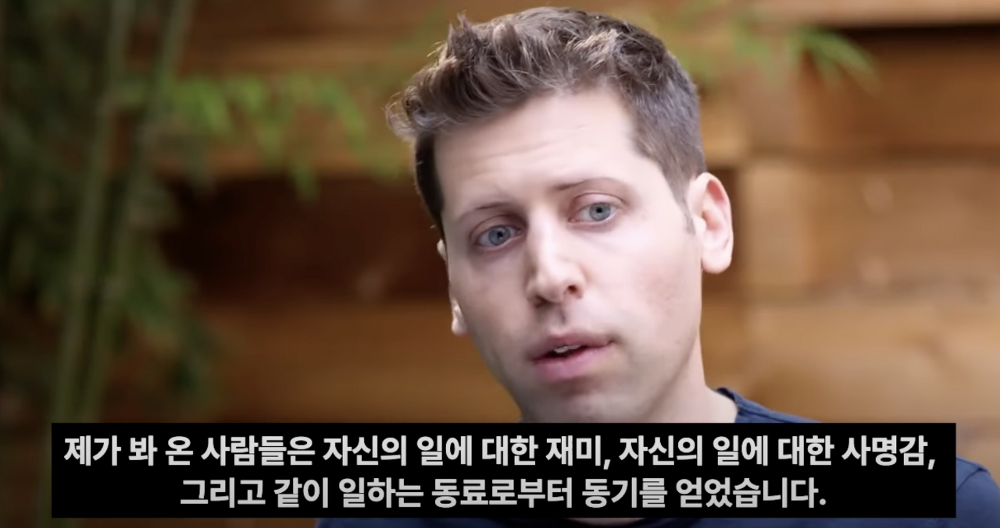

이따금씩 다른 사람들을 만나 나 자신에 대해 소개할 때, 스스로를 프론트엔드 엔지니어라고 이야기하기보다는 문제를 푸는 사람이라고 이야기하는 것을 좋아한다. 내가 바라는 나의 미래의 모습은 실력 있는 엔지니어가 되는 것보다는 내가 풀고 싶은 문제를 어떤 방식으로든 풀어내는 사람에 더 가깝기 때문이다. 그렇다면 내가 풀고 싶은 문제가 무엇인지를 정의하는 것이 이치상 가장 먼저 나와야 하는 것임에 분명하며, 이는 필연적으로 "그렇다면 문제라는 것은 무엇인가"에 대한 질문으로 이어지게 된다. 이런 사고의 흐름을 거치는 것 자체가 "문제"라는 단어에 대한 정확한 정의 없이 나를 문제를 푸는 사람으로 정의했다는 것을 방증하는 것이기도 해서 부끄럽기도 하지만, 웹 개발을 시작할 때 웹에 대해 잘 알지 못하고 군 복무를 위해 시작했다가 몇 년이 지나서야 "웹이 무엇인가"라는 질문을 던졌던 나의 과거를 돌아볼 때, 썩 나쁜 방식은 아닌 것 같다.

문제(Problem)는 내가 원하는 모습이 명확하게 그려져 있을 때, 그 모습과 현재 상태에 대한 차이로부터 나온다고 생각한다. 이렇게 문제를 "원하는 미래"와 "객관적 현실"의 Diff로 바라보게 되면, 좋은 문제라는 건 현실을 객관적으로 파악할 수 있는 능력과 새로운 미래를 상상하는 능력에서 나오게 되며, 따라서 좋은 문제를 발견하는 사람이 되기 위해서는 이 두 가지를 갖춰야 함을 연역해 볼 수 있다. 현실을 객관적으로 파악하는 능력의 중요성은 좋은 문제를 찾아내는 것 이외에도 이미 중요하게 여겨지므로 문제를 발견하기 위한 핵심 요소를 "새로운 미래를 구상하는 능력"으로 정의할 수 있을 것이다.

새로운 미래를 구상하는 힘을 가지기 위해서는 어떤 것들이 필요할까. 여러 가지 요소들을 떠올려볼 수 있겠지만 당장 떠오르는 생각은 크게 두 가지이다. 하나는 비아 네거티바(Via Negativa)의 관점으로 접근할 것. 그리고 감성과 직관을 기르는 훈련을 할 것.

수많은 요소들이 상호작용하며 만들어내는 현실 세계에서 기껏해야 수백가지의 옵션들의 인과관계를 가지고 미래를 예측하는 것은 불가능한 일이다. 물론 어떤 일이 일어난 다음 등장하는 사후적 설명은 이 미래를 마치 "예측"할 수 있었던 것처럼 착각하게 만들지만 복잡계에서 발생하는 일들은 거의 대부분 사후적 설명만이 가능할 뿐이다. 이 세상은 진공상태가 아니며, 우리가 고려할 수 있는 것보다 훨씬 더 많은 요인들이 관여하기 때문에 인과적으로 예측하기가 거의 불가능하다. 반면, 어떤 대상의 프래질을 측정하여 이것이 미래에 남아있을지 남아있지 않을지를 탐지하는 것은 비교적 간단하다고 생각한다. 이를테면 신발이라는 것은 수천 년 동안 거의 비슷한 형태로 유지되어 왔으며, 이것은 앞으로 5년 뒤에도 거의 비슷한 형태로 남아있을 가능성이 크다. 즉, 미래에서 무언가를 "더하는 방식"으로 예측하며 구상하는 것보다 무엇이 "사라질 것인가"의 관점에서 생각한다면 더 나은 미래를 예측하는데 도움이 되는 보다 현실적인 도움이 될 것이라 생각한다. 

또 다른 하나의 축은 감성과 직관을 기르는 것인데, 개인적으로 직관은 어떤 대상에 대해 깊이 몰두하며 스스로 생각하는 사고의 훈련, 그중에서도 본질을 찾아 헤매는 추상적 사고와, 한 분야에서 다른 분야로 생각을 건너 뛰어, 그 사이를 이을 수 있게 만드는 은유적 사고를 치열하게 훈련한 결과로 나온다고 생각한다. 이런 과정을 수없이 반복하는 사람들이 이야기하는 "이건 뭔가 될 것 같은데"라는 직관은 느낌으로 다가오지만, 실제로 그들은 말로 표현하기 전에 어떤 무언가를 본 것에 가까우며 리처드 파인만이나, 아인슈타인 같은 사람들도 자신들의 업적으로 남겨진 중요한 발견들을 글이나 말로 설명하기 전에 무엇인가를 보았다고 이야기한다. 즉, 더 나은 미래를 상상하는 것이 처음부터 논리적으로 정제된 언어의 형태를 띨 필요는 없으며, 이것을 "보고 느껴야"한다고 생각하다. 이러한 직관은 단순히 머리로 상상하는 것을 넘어서 보고 만지고 냄새 맡고 느낄 수 있어야 한다고 생각하며, 대상을 더 잘 느끼기 위해서는 감성을 기르는 훈련도 중요하게 여겨진다.

좋은 문제를 찾아내고, 그것을 풀기 위해 몰두하는 경험은 큰 성취감을 준다. 어떤 회사의 비전을 보고 감명받아 입사를 지원하기로 결정했다면 그것은 이 회사가 풀려고 하는 문제, 즉 이 회사가 그리는 미래에 대해 공감하고 그 미래를 만들어가는 과정에 기여하고 싶다는 생각이 들었기 때문일 것이다. 생각이 여기까지 이어지다 보니 이제는 스스로를 "문제를 푸는 사람"으로 정의하기보다 "문제를 찾아내는 사람" 혹은 "문제를 만들어내는 사람"으로 정의하고 싶어진다.

>  ‘문제’란 도대체 무엇일까요? 그것은 ‘원하는 모습과 현재 모습의 차이’를 말합니다. 원하는 모습이 명확하게 그려져 있다면, 문제는 필연적으로 발생하기 마련입니다. 즉, 현대 사회의 많은 영역에서 ‘문제’가 희소해지고 있다는 것은 우리 사회와 조직이 ‘새로운 세상을 구상하는 힘’을 잃어가고 있다는 것을 의미하기도 합니다.  
>  
> - 감성과 지성으로 일한다는 것