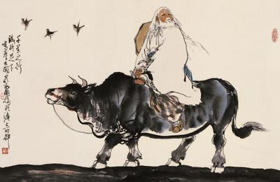

---  
share: true  
toc: true  
categories: [Thoughts]  
tags: [philosophy, 도덕경, 노자, business]  
layout: post  
title: "구체로부터의 추상, 현실로부터의 철학"  
date: "2023-06-10"  
github_title: "2023-06-10-구체로부터의 추상, 현실로부터의 철학"  
---  
  
  
  
  
  
철학이 무엇이냐고 물어보면 "시대의 흐름을 관념으로 포착한 것"이라 대답하곤 한다. 이는 철학이 있고 세상이 있는 것이 아니라 세상이 먼저 있고, 거기서 포착해 낸 관념이 철학이라는 것을 의미한다. 이런 의미에서 어떤 하나의 철학이나 하나의 이론을 진실의 원천(Single Source of Truth)로 두고 거기서 연역적으로 사고하며 현상이나 세상을 그 틀에 끼워 맞춰보려는 시도를 항상 경계하려고 노력한다. (경계하는 것이 부정한다는 의미는 아니다.) 이러한 사고에는 노자의 무위 사상, 그중에서도 "개념화를 경계하는 태도"가 적지 않은 영향을 미쳤다.  
  
  
우리의 뇌는 본래 "개념화"를 좋아하는 것 같다. A라는 현상과 B라는 현상과 C라는 현상을 겪고 나면, 이 현상들을 더 잘 기억하기 위해 나름의 최적화 매커니즘을 거쳐 공통점을 뽑아내고 이를 하나의 개념으로 묶는 것에 익숙하다. 개념화는 수많은 현상들의 공통점을 찾아내어  묶어냄으로써 새로운 현상 D가 발생했을 때, 이를 이 개념에 넣을지 말지를 결정하는 방식으로 의사결정을 내리는데 필요한 에너지를 줄인다. 우리의 뇌가 개념화를 활용할 수 있게 되면서 우리는 더 많은 정보들을 사용해서 추론하고 의사결정을 내릴 수 있게 되었지만, 반대로 각 현상이 가지고 있는 개별적인 특성들을 놓치고, 기존 개념을 구성하는 현상에 대한 아집을 만들어 내기도 했다. 즉 많은 것들을 이해하고 추론할 수 있게 되었지만, 오히려 현상을 "있는 그대로 보는 능력"을 너무나도 많이 잃어버리게 된 것이다. 이는 개념의 정의 자체가 "일반적인 것"을 내포하기 때문이다. 현상에서 일반적이지 않은 특수한 것, 사적인 것이 모두 버려지고 난 공통의 것을 관념적으로 포착한 것이 개념이기 때문에 개념에는 사적인 특성이 배제되어 있다.  
  
  
지식은 정말 우리를 자유롭게 하는가? 박을 사용해서 속을 긁어서 국을 끓이고, 껍질로는 바가지로 만드는 방법에 대해 학교에서 배운 사람이 박을 물에 띄워 배처럼 가지고 놀고 있는 아이를 보며 "그건 박을 사용하는 방법이 아니야"라고 이야기한다면, 이 사람이 가지고 있는 박에 대한 지식은 이 사람을 자유롭게 하지 못한다. 되려 아집에 사로잡혀 있는 그대로의 현실을 보지 못하게 하고, 새로운 가능성을 제거해 버리는 역할을 할 뿐이다. 수많은 다양한 상황 속에서 나도 나만의 "박에 대한 지식"으로 인해 아집에 사로잡혀 새로운 가능성들과 있는 그대로의 현실을 보지 못하게 되는 것은 아닌지 고민을 하게 된다.  
  
  
노자에 따르면, 이 세계는 관계와 변화로 되어 있다고 한다. 그리고 내가 학습하는 과정에서 습득한 개념은 대개 언어의 형태로 표현된다. 하지만 상호 연관된 구조 속에서 부단한 변화를 이행하는 세계를 언어는 제대로 반영할 수 없다. "언"의 행위에는 반드시 내용, 즉 의미가 들어 있는데, 그 내용과 의미에 대응되는 세계의 어떤 대상은 항상 변화와 관계 속에 있는 것이므로 특정한 것으로 확정될 수 없기 때문이다. 따라서 내가 "언어"의 형태로 가지고 있는 개념은 나의 세계와 이념을 구성하는 데에 있어서 필수적인 역할을 수행하며 나의 이해와 직관을 확장시키지만, 변화하는 세계에서 발생하는 현상을 항상 정확하게 반영하지 못하고 있을 가능성이 높다.  
  
  
불과 몇년 전까지만 해도 1년 뒤의 내 모습, 3년 뒤의 내 모습, 5년 뒤의 내 모습을 그려보고 그 계획에 맞춰 오늘 하루를 계획하는 것을 좋아했다. 하지만 내 계획이 내가 갖고 있는 개념들로부터 비롯된 인과적 추론의 산물이며, 현실에서 사적인 측면들을 제거하고 일반적인 것들만 남겨 언어의 형태로 정제한 것들이기에 변화하는 세계를 올바르게 반영한다고 보기 어려웠다. (게다가 나는 미래를 제대로 예측하지도 못한다. 내가 1년 전에 예측한 2023년은 도대체 맞는 것이 하나도 없다.) 따라서 치밀하게 여러 변수들을 고려하며 미래를 예측하여 계획을 세우기보다는 계획없이 그저 세상을 관찰하기로 결정했고, 그저 주어진 하루를 열심히 관찰하면서 살고 있다. 동그란 그릇이 주어지면 동그랗게 담기고, 네모난 그릇이 주어지면 네모나게 담기는 대기면성의 면모를 갖춘 이가 되는 것이 목표이다. (이것이 대책없이 산다는 것을 의미하지는 않는다. 대기면성의 면모를 갖추기 위해서는 변하는 세상에서 변하지 않는 것들을 찾아내어 역량으로 만드는 일이 중요하다고 생각하며 이는 개별 현상 속에서 isomorphic한 것들을 찾아내는 노력을 통해 도달할 수 있다고 생각한다.)  
  
  
노자에 따르면 자신을 천하만큼 사랑하고 귀하게 여기는 사람만이 진정한 의미에서 천하를 맡을 수 있다고 한다. 이는 이념적 세계에 머무르지 않고 개별 현상으로 나아가라는 것을 의미하는 것이라 생각한다. 있는 그대로의 현실을 느끼고 받아들이고 관찰하며 경험하는 자, 즉 봄을 "만지는 자"가 되기위한 고민을 더 해봐야 하겠다.  
  
> 그러므로 자신의 몸을 천하만큼이나 귀하게 여긴다면 천하를 줄 수 있고,    
> 자신의 몸을 천하만큼이나 아낀다면 천하를 맡길 수 있을 것이다.    
> - 노자 도덕경 13장  
  
